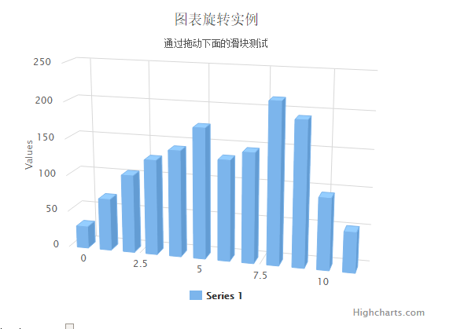

# Highcharts 3D柱形图

以下实例演示了3D柱形图。

我们在前面的章节已经了解了 Highcharts 基本配置语法。接下来让我们来看下其他的配置。

## 配置

### chart.options3d 配置

以下列出了 3D 图的基本配置，设置 chart 的 type 属性为 column，options3d 选项可设置三维效果。

```
var chart =  { type:  'column', options3d:  { enabled:  true,  //显示图表是否设置为3D， 我们将其设置为 true alpha:  15,  //图表视图旋转角度 beta:  15,  //图表视图旋转角度 depth:  50,  //图表的合计深度，默认为100 viewDistance:  25  //定义图表的浏览长度  }  };
```

### 实例

文件名：highcharts_3d_column.htm

```
<html>  <head>  <title>Highcharts 教程 | 菜鸟教程(runoob.com)</title>  <script  src="http://apps.bdimg.com/libs/jquery/2.1.4/jquery.min.js"></script>  <script  src="/try/demo_source/highcharts.js"></script>  <script  src="/try/demo_source/highcharts-3d.js"></script>  </head>  <body>  <div  id="container"  style="width:  550px; height:  400px; margin:  0  auto"></div>  <div  id="sliders">  <table>  <tr><td>Alpha Angle</td><td><input  id="R0"  type="range"  min="0"  max="45"  value="15"/>  <span  id="R0-value"  class="value"></span></td></tr>  <tr><td>Beta Angle</td><td><input  id="R1"  type="range"  min="0"  max="45"  value="15"/>  <span  id="R1-value"  class="value"></span></td></tr>  </table>  </div>  <script  language="JavaScript"> $(document).ready(function()  {  var chart =  { renderTo:  'container', type:  'column', margin:  75, options3d:  { enabled:  true, alpha:  15, beta:  15, depth:  50, viewDistance:  25  }  };  var title =  { text:  '图表旋转实例'  };  var subtitle =  { text:  '通过拖动下面的滑块测试'  };  var plotOptions =  { column:  { depth:  25  }  };  var series=  [{ data:  [29.9,  71.5,  106.4,  129.2,  144.0,  176.0,  135.6,  148.5,  216.4,  194.1,  95.6,  54.4]  }];  var json =  {}; json.chart = chart; json.title = title; json.subtitle = subtitle; json.series = series; json.plotOptions = plotOptions;  var highchart =  new  Highcharts.Chart(json);  function showValues()  { $('#R0-value').html(highchart.options.chart.options3d.alpha); $('#R1-value').html(highchart.options.chart.options3d.beta);  }  // Activate the sliders $('#R0').on('change',  function  ()  { highchart.options.chart.options3d.alpha =  this.value; showValues(); highchart.redraw(false);  }); $('#R1').on('change',  function  ()  { highchart.options.chart.options3d.beta =  this.value; showValues(); highchart.redraw(false);  }); showValues();  });  </script>  </body>  </html>
```


以上实例输出结果为：


