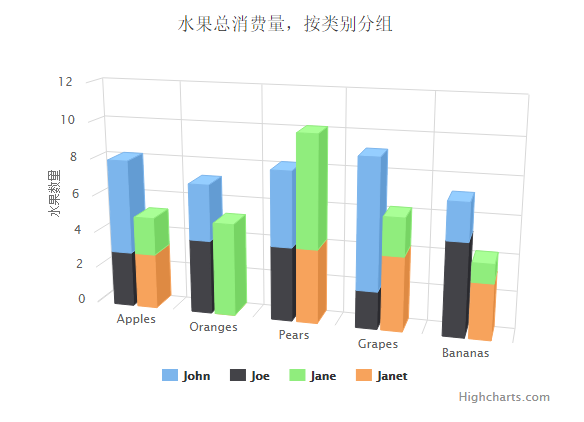

# Highcharts 堆叠3D柱形图

以下实例演示了堆叠3D柱形图。

我们在前面的章节已经了解了 Highcharts 基本配置语法。接下来让我们来看下其他的配置。

## 配置

### chart.options3d 配置

以下列出了 3D 图的基本配置，设置 chart 的 type 属性为 column，options3d 选项可设置三维效果。

```
var chart =  { type:  'column', options3d:  { enabled:  true,  //显示图表是否设置为3D， 我们将其设置为 true alpha:  15,  //图表视图旋转角度 beta:  15,  //图表视图旋转角度 depth:  50,  //图表的合计深度，默认为100 viewDistance:  25  //定义图表的浏览长度  }  };
```

### 实例

文件名：highcharts_3d_stacking.htm

```
<html>  <head>  <title>Highcharts 教程 | 菜鸟教程(runoob.com)</title>  <script  src="http://apps.bdimg.com/libs/jquery/2.1.4/jquery.min.js"></script>  <script  src="/try/demo_source/highcharts.js"></script>  <script  src="/try/demo_source/highcharts-3d.js"></script>  </head>  <body>  <div  id="container"  style="width:  550px; height:  400px; margin:  0  auto"></div>  <script  language="JavaScript"> $(document).ready(function()  {  var chart =  { type:  'column', marginTop:  80, marginRight:  40, options3d:  { enabled:  true, alpha:  15, beta:  15, viewDistance:  25, depth:  40  }  };  var title =  { text:  '水果总消费量，按类别分组'  };  var xAxis =  { categories:  ['Apples',  'Oranges',  'Pears',  'Grapes',  'Bananas']  };  var yAxis =  { allowDecimals:  false, min:  0, title:  { text:  '水果数量'  }  };  var tooltip =  { headerFormat:  '<b>{point.key}</b><br>', pointFormat:  '<span style="color:{series.color}">\u25CF</span> {series.name}: {point.y} / {point.stackTotal}'  };  var plotOptions =  { column:  { stacking:  'normal', depth:  40  }  };  var series=  [{ name:  'John', data:  [5,  3,  4,  7,  2], stack:  'male'  },  { name:  'Joe', data:  [3,  4,  4,  2,  5], stack:  'male'  },  { name:  'Jane', data:  [2,  5,  6,  2,  1], stack:  'female'  },  { name:  'Janet', data:  [3,  0,  4,  4,  3], stack:  'female'  }];  var json =  {}; json.chart = chart; json.title = title; json.xAxis = xAxis; json.yAxis = yAxis; json.tooltip = tooltip; json.plotOptions = plotOptions; json.series = series; $('#container').highcharts(json);  });  </script>  </body>  </html>
```


以上实例输出结果为：


