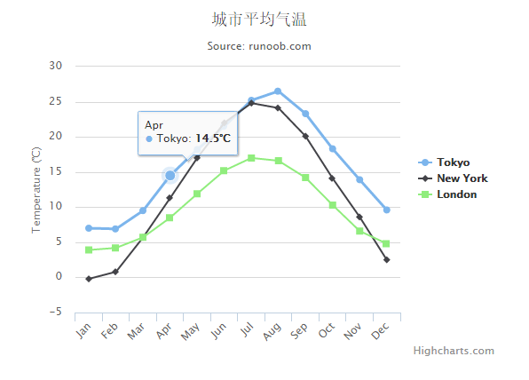

# Highcharts 基本曲线图

以下实例是基础曲线图。我们在前面的章节已经了解了 Highcharts 配置语法。接下来让我们来看个完整实例：

### 实例

文件名：highcharts_line_basic.htm

```
<html>  <head>  <title>Highcharts 教程 | 菜鸟教程(runoob.com)</title>  <script  src="http://apps.bdimg.com/libs/jquery/2.1.4/jquery.min.js"></script>  <script  src="/try/demo_source/highcharts.js"></script>  </head>  <body>  <div  id="container"  style="width:  550px; height:  400px; margin:  0  auto"></div>  <script  language="JavaScript"> $(document).ready(function()  {  var title =  { text:  '城市平均气温'  };  var subtitle =  { text:  'Source: runoob.com'  };  var xAxis =  { categories:  ['Jan',  'Feb',  'Mar',  'Apr',  'May',  'Jun',  'Jul',  'Aug',  'Sep',  'Oct',  'Nov',  'Dec']  };  var yAxis =  { title:  { text:  'Temperature (\xB0C)'  }, plotLines:  [{ value:  0, width:  1, color:  '#808080'  }]  };  var tooltip =  { valueSuffix:  '\xB0C'  }  var legend =  { layout:  'vertical', align:  'right', verticalAlign:  'middle', borderWidth:  0  };  var series =  [  { name:  'Tokyo', data:  [7.0,  6.9,  9.5,  14.5,  18.2,  21.5,  25.2,  26.5,  23.3,  18.3,  13.9,  9.6]  },  { name:  'New York', data:  [-0.2,  0.8,  5.7,  11.3,  17.0,  22.0,  24.8,  24.1,  20.1,  14.1,  8.6,  2.5]  },  { name:  'London', data:  [3.9,  4.2,  5.7,  8.5,  11.9,  15.2,  17.0,  16.6,  14.2,  10.3,  6.6,  4.8]  }  ];  var json =  {}; json.title = title; json.subtitle = subtitle; json.xAxis = xAxis; json.yAxis = yAxis; json.tooltip = tooltip; json.legend = legend; json.series = series; $('#container').highcharts(json);  });  </script>  </body>  </html>
```


以上实例输出结果为：


