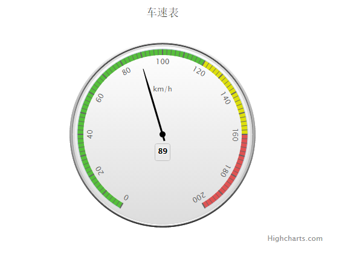

# Highcharts 测量图

以下实例演示了测量图。

我们在前面的章节已经了解了 Highcharts 基本配置语法。接下来让我们来看下其他的配置。

## 配置

### chart.type 配置

配置 chart 的 type 为 'gauge' 。chart.type 描述了图表类型。默认值为 "line"。

```
var chart =  { type:  'guage'  };
```

### pane 配置

pane 只适用在极坐标图和角度测量仪。此可配置对象持有组合x轴和y周的常规选项。每个x轴和y轴都可以通过索引关联到窗格中。

```
var pane =  { startAngle:  -150,  // x轴或测量轴的开始度数，以度数的方式给出。0是北 endAngle:  150  //x轴极坐标或角度轴的最终度数，以度数的方式给出。0是北  };
```

### 实例

文件名：highcharts_guage_angular.htm

```
<html>  <head>  <title>Highcharts 教程 | 菜鸟教程(runoob.com)</title>  <script  src="http://apps.bdimg.com/libs/jquery/2.1.4/jquery.min.js"></script>  <script  src="/try/demo_source/highcharts.js"></script>  <script  src="/try/demo_source/highcharts-more.js"></script>  </head>  <body>  <div  id="container"  style="width:  550px; height:  400px; margin:  0  auto"></div>  <script  language="JavaScript"> $(document).ready(function()  {  var chart =  { type:  'gauge', plotBackgroundColor:  null, plotBackgroundImage:  null, plotBorderWidth:  0, plotShadow:  false  };  var title =  { text:  '车速表'  };  var pane =  { startAngle:  -150, endAngle:  150, background:  [{ backgroundColor:  { linearGradient:  { x1:  0, y1:  0, x2:  0, y2:  1  }, stops:  [  [0,  '#FFF'],  [1,  '#333']  ]  }, borderWidth:  0, outerRadius:  '109%'  },  { backgroundColor:  { linearGradient:  { x1:  0, y1:  0, x2:  0, y2:  1  }, stops:  [  [0,  '#333'],  [1,  '#FFF']  ]  }, borderWidth:  1, outerRadius:  '107%'  },  {  // default background  },  { backgroundColor:  '#DDD', borderWidth:  0, outerRadius:  '105%', innerRadius:  '103%'  }]  };  // the value axis  var yAxis =  { min:  0, max:  200, minorTickInterval:  'auto', minorTickWidth:  1, minorTickLength:  10, minorTickPosition:  'inside', minorTickColor:  '#666', tickPixelInterval:  30, tickWidth:  2, tickPosition:  'inside', tickLength:  10, tickColor:  '#666', labels:  { step:  2, rotation:  'auto'  }, title:  { text:  'km/h'  }, plotBands:  [{ from:  0, to:  120, color:  '#55BF3B'  // green  },  { from:  120, to:  160, color:  '#DDDF0D'  // yellow  },  { from:  160, to:  200, color:  '#DF5353'  // red  }]  };  var series=  [{ name:  'Speed', data:  [80], tooltip:  { valueSuffix:  ' km/h'  }  }];  var json =  {}; json.chart = chart; json.title = title; json.pane = pane; json.yAxis = yAxis; json.series = series;  // Add some life  var chartFunction =  function  (chart)  {  if  (!chart.renderer.forExport)  { setInterval(function  ()  {  var point = chart.series[0].points[0], newVal, inc =  Math.round((Math.random()  -  0.5)  *  20); newVal = point.y + inc;  if  (newVal <  0  || newVal >  200)  { newVal = point.y - inc;  } point.update(newVal);  },  3000);  }  }; $('#container').highcharts(json,chartFunction);  });  </script>  </body>  </html>
```


以上实例输出结果为：


