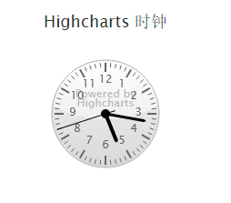

# Highcharts 时钟

以下实例演示了时钟。

我们在前面的章节已经了解了 Highcharts 基本配置语法。接下来让我们来看下其他的配置。

## 配置

### chart.type 配置

配置 chart 的 type 为 'gauge' 。chart.type 描述了图表类型。默认值为 "line"。

```
var chart =  { type:  'gauge'  };
```

### pane 配置

pane 只适用在极坐标图和角度测量仪。此可配置对象持有组合x轴和y周的常规选项。每个x轴和y轴都可以通过索引关联到窗格中。

```
var pane =  { startAngle:  -150,  // x轴或测量轴的开始度数，以度数的方式给出。0是北 endAngle:  150  //x轴极坐标或角度轴的最终度数，以度数的方式给出。0是北  };
```

### 实例

文件名：highcharts_guage_clock.htm

```
<html>  <head>  <title>Highcharts 教程 | 菜鸟教程(runoob.com)</title>  <script  src="http://apps.bdimg.com/libs/jquery/2.1.4/jquery.min.js"></script>  <script  src="/try/demo_source/highcharts.js"></script>  <script  src="/try/demo_source/highcharts-more.js"></script>  </head>  <body>  <div  id="container"  style="width:  550px; height:  400px; margin:  0  auto"></div>  <script  language="JavaScript"> $(document).ready(function()  {  /**
   * 获取当前时间
   */  function getNow()  {  var now =  new  Date();  return  { hours: now.getHours()  + now.getMinutes()  /  60, minutes: now.getMinutes()  *  12  /  60  + now.getSeconds()  *  12  /  3600, seconds: now.getSeconds()  *  12  /  60  };  }  /**
   * Pad numbers
   */  function pad(number, length)  {  // Create an array of the remaining length + 1 and join it with 0's  return  new  Array((length ||  2)  +  1  -  String(number).length).join(0)  + number;  }  var now = getNow();  var chart =  { type:  'gauge', plotBackgroundColor:  null, plotBackgroundImage:  null, plotBorderWidth:  0, plotShadow:  false, height:  200  };  var credits =  { enabled:  false  };  var title =  { text:  'Highcharts 时钟'  };  var pane =  { background:  [{  // default background  },  {  // reflex for supported browsers backgroundColor:  Highcharts.svg ?  { radialGradient:  { cx:  0.5, cy:  -0.4, r:  1.9  }, stops:  [  [0.5,  'rgba(255, 255, 255, 0.2)'],  [0.5,  'rgba(200, 200, 200, 0.2)']  ]  }  :  null  }]  };  // the value axis  var yAxis =  { labels:  { distance:  -20  }, min:  0, max:  12, lineWidth:  0, showFirstLabel:  false, minorTickInterval:  'auto', minorTickWidth:  1, minorTickLength:  5, minorTickPosition:  'inside', minorGridLineWidth:  0, minorTickColor:  '#666', tickInterval:  1, tickWidth:  2, tickPosition:  'inside', tickLength:  10, tickColor:  '#666', title:  { text:  'Powered by<br/>Highcharts', style:  { color:  '#BBB', fontWeight:  'normal', fontSize:  '8px', lineHeight:  '10px'  }, y:  10  }  };  var tooltip =  { formatter:  function  ()  {  return  this.series.chart.tooltipText;  }  };  var series=  [{ data:  [{ id:  'hour', y: now.hours, dial:  { radius:  '60%', baseWidth:  4, baseLength:  '95%', rearLength:  0  }  },  { id:  'minute', y: now.minutes, dial:  { baseLength:  '95%', rearLength:  0  }  },  { id:  'second', y: now.seconds, dial:  { radius:  '100%', baseWidth:  1, rearLength:  '20%'  }  }], animation:  false, dataLabels:  { enabled:  false  }  }];  var json =  {}; json.chart = chart; json.credits = credits; json.title = title; json.pane = pane; json.yAxis = yAxis; json.tooltip = tooltip; json.series = series; $('#container').highcharts(json, chartFunction);  // Add some life  var chartFunction =  function  (chart)  { setInterval(function  ()  { now = getNow();  var hour = chart.get('hour'), minute = chart.get('minute'), second = chart.get('second'),  // run animation unless we're wrapping around from 59 to 0 animation = now.seconds ===  0  ?  false  :{ easing:  'easeOutElastic'};  // Cache the tooltip text chart.tooltipText = pad(Math.floor(now.hours),  2)  +  ':'  + pad(Math.floor(now.minutes *  5),  2)  +  ':'  + pad(now.seconds *  5,  2); hour.update(now.hours,  true, animation); minute.update(now.minutes,  true, animation); second.update(now.seconds,  true, animation);  },  1000);  };  });  // Extend jQuery with some easing (copied from jQuery UI) $.extend($.easing,  { easeOutElastic:  function  (x, t, b, c, d)  {  var s=1.70158;var p=0;var a=c;  if  (t==0)  return b;  if  ((t/=d)==1)  return b+c;  if  (!p) p=d*.3;  if  (a <  Math.abs(c))  { a=c;  var s=p/4;  }  else  var s = p/(2*Math.PI)  *  Math.asin (c/a);  return a*Math.pow(2,-10*t)  *  Math.sin(  (t*d-s)*(2*Math.PI)/p )  + c + b;  }  });  </script>  </body>  </html>
```


以上实例输出结果为：


