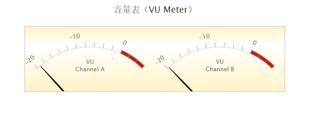

# Highcharts 音量表（VU Meter）

以下实例演示了音量表（VU Meter）。

我们在前面的章节已经了解了 Highcharts 基本配置语法。接下来让我们来看下其他的配置。

## 配置

### chart.type 配置

配置 chart 的 type 为 'gauge' 。chart.type 描述了图表类型。默认值为 "line"。

```
var chart =  { type:  'gauge'  };
```

### pane 配置

pane 只适用在极坐标图和角度测量仪。此可配置对象持有组合x轴和y周的常规选项。每个x轴和y轴都可以通过索引关联到窗格中。

```
var pane =  { startAngle:  -150,  // x轴或测量轴的开始度数，以度数的方式给出。0是北 endAngle:  150  //x轴极坐标或角度轴的最终度数，以度数的方式给出。0是北  };
```

### 实例

文件名：highcharts_vumeter.htm

```
<html>  <head>  <title>Highcharts 教程 | 菜鸟教程(runoob.com)</title>  <script  src="http://apps.bdimg.com/libs/jquery/2.1.4/jquery.min.js"></script>  <script  src="/try/demo_source/highcharts.js"></script>  <script  src="/try/demo_source/highcharts-more.js"></script>  </head>  <body>  <div  id="container"  style="width:  550px; height:  400px; margin:  0  auto"></div>  <script  language="JavaScript"> $(document).ready(function()  {  var chart =  { type:  'gauge', plotBorderWidth:  1, plotBackgroundColor:  { linearGradient:  { x1:  0, y1:  0, x2:  0, y2:  1  }, stops:  [  [0,  '#FFF4C6'],  [0.3,  '#FFFFFF'],  [1,  '#FFF4C6']  ]  }, plotBackgroundImage:  null, height:  200  };  var credits =  { enabled:  false  };  var title =  { text:  '音量表（VU Meter）'  };  var pane =  [{ startAngle:  -45, endAngle:  45, background:  null, center:  ['25%',  '145%'], size:  300  },  { startAngle:  -45, endAngle:  45, background:  null, center:  ['75%',  '145%'], size:  300  }];  var yAxis =  [{ min:  -20, max:  6, minorTickPosition:  'outside', tickPosition:  'outside', labels:  { rotation:  'auto', distance:  20  }, plotBands:  [{ from:  0, to:  6, color:  '#C02316', innerRadius:  '100%', outerRadius:  '105%'  }], pane:  0, title:  { text:  'VU<br/><span style="font-size:8px">Channel A</span>', y:  -40  }  },  { min:  -20, max:  6, minorTickPosition:  'outside', tickPosition:  'outside', labels:  { rotation:  'auto', distance:  20  }, plotBands:  [{ from:  0, to:  6, color:  '#C02316', innerRadius:  '100%', outerRadius:  '105%'  }], pane:  1, title:  { text:  'VU<br/><span style="font-size:8px">Channel B</span>', y:  -40  }  }];  var plotOptions =  { gauge:  { dataLabels:  { enabled:  false  }, dial:  { radius:  '100%'  }  }  };  var series=  [{ data:  [-20], yAxis:  0  },  { data:  [-20], yAxis:  1  }];  var json =  {}; json.chart = chart; json.credits = credits; json.title = title; json.pane = pane; json.yAxis = yAxis; json.plotOptions = plotOptions; json.series = series;  // Add some life  var chartFunction =  function  (chart)  { setInterval(function  ()  {  if  (chart.series)  {  // the chart may be destroyed  var left = chart.series[0].points[0], right = chart.series[1].points[0], leftVal, rightVal, inc =  (Math.random()  -  0.5)  *  3; leftVal = left.y + inc; rightVal = leftVal + inc /  3;  if  (leftVal <  -20  || leftVal >  6)  { leftVal = left.y - inc;  }  if  (rightVal <  -20  || rightVal >  6)  { rightVal = leftVal;  } left.update(leftVal,  false); right.update(rightVal,  false); chart.redraw();  }  },  500);  }; $('#container').highcharts(json, chartFunction);  });  </script>  </body>  </html>
```


以上实例输出结果为：


