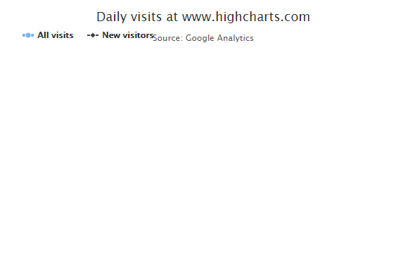

# Highcharts 异步加载数据曲线图表

以下实例演示了异步加载数据曲线图表。这边我们通过 jQuery.getJSON() 方法从异步加载 csv 文件：

我们在前面的章节已经了解了 Highcharts 配置语法。接下来让我们来看个完整实例：

## 导入 data.js 文件

异步加载数据需要引入以下js 文件：

```
<script  src="http://code.highcharts.com/modules/data.js"></script>  
```

## 配置

### X 轴

以每周为间隔设置 X 轴：

```
var xAxis =  { tickInterval:  7  *  24  *  3600  *  1000,  // 一周 tickWidth:  0, gridLineWidth:  1, labels:  { align:  'left', x:  3, y:  -3  }  };
```

### Y 轴

以每周为间隔设置 Y 轴：

配置两个 Y 轴：

```
var yAxis =  [{  // 左边 Y 轴 title:  { text:  null  }, labels:  { align:  'left', x:  3, y:  16, format:  '{value:.,0f}'  }, showFirstLabel:  false  },{  // 右边 Y 轴 linkedTo:  0, gridLineWidth:  0, opposite:  true, title:  { text:  null  }, labels:  { align:  'right', x:  -3, y:  16, format:  '{value:.,0f}'  }, showFirstLabel:  false  }  ];
```

### plotOptions

plotOptions用于设置图表中的数据点相关属性。

```
  var plotOptions =  { series:  { cursor:  'pointer', point:  { events:  { click:  function  (e)  { hs.htmlExpand(null,  { pageOrigin:  { x: e.pageX || e.clientX, y: e.pageY || e.clientY }, headingText:  this.series.name, maincontentText:  Highcharts.dateFormat('%A, %b %e, %Y',  this.x)  +  ':<br/> '  +  this.y +  ' visits', width:  200  });  }  }  }, marker:  { lineWidth:  1  }  }  }
```

### 实例

文件名：highcharts_line_ajax.html

```
<html>  <head>  <title>Highcharts Tutorial</title>  <title>Highcharts 教程 | 菜鸟教程(runoob.com)</title>  <script  src="http://apps.bdimg.com/libs/jquery/2.1.4/jquery.min.js"></script>  <script  src="/try/demo_source/highcharts.js"></script>  <script  src="http://code.highcharts.com/highcharts-more.js"></script>  <script  src="http://code.highcharts.com/modules/data.js"></script>  </head>  <body>  <div  id="container"  style="width:  550px; height:  400px; margin:  0  auto"></div>  <script  language="JavaScript"> $(document).ready(function()  {  var title =  { text:  'Daily visits at www.highcharts.com'  };  var subtitle =  { text:  'Source: Google Analytics'  };  var xAxis =  { tickInterval:  7  *  24  *  3600  *  1000,  // 一周 tickWidth:  0, gridLineWidth:  1, labels:  { align:  'left', x:  3, y:  -3  }  };  var yAxis =  [{  // 左边 y 轴 title:  { text:  null  }, labels:  { align:  'left', x:  3, y:  16, format:  '{value:.,0f}'  }, showFirstLabel:  false  },{  // 右边 y 轴 linkedTo:  0, gridLineWidth:  0, opposite:  true, title:  { text:  null  }, labels:  { align:  'right', x:  -3, y:  16, format:  '{value:.,0f}'  }, showFirstLabel:  false  }  ];  var tooltip =  { shared:  true, crosshairs:  true  }  var legend =  { align:  'left', verticalAlign:  'top', y:  20, floating:  true, borderWidth:  0  };  var plotOptions =  { series:  { cursor:  'pointer', point:  { events:  { click:  function  (e)  { hs.htmlExpand(null,  { pageOrigin:  { x: e.pageX || e.clientX, y: e.pageY || e.clientY }, headingText:  this.series.name, maincontentText:  Highcharts.dateFormat('%A, %b %e, %Y',  this.x)  +  ':<br/> '  +  this.y +  ' visits', width:  200  });  }  }  }, marker:  { lineWidth:  1  }  }  }  var series =  [{ name:  'All visits', lineWidth:  4, marker:  { radius:  4  }  },  { name:  'New visitors'  }]  var json =  {}; json.title = title; json.subtitle = subtitle; json.xAxis = xAxis; json.yAxis = yAxis; json.tooltip = tooltip; json.legend = legend; json.series = series; json.plotOptions = plotOptions; $.getJSON('http://www.highcharts.com/samples/data/jsonp.php?filename=analytics.csv&callback=?',  function  (csv)  {  var data =  { csv: csv }; json.data = data; $('#container').highcharts(json);  });  });  </script>  </body>  </html>
```


以上实例输出结果为：


