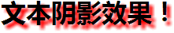

# CSS3 文本效果


## CSS3 文本效果

CSS3 包含多个新的文本特性。

在本章中，您将学到如下文本属性：

*   text-shadow
*   word-wrap

## 浏览器支持

| 属性 | 浏览器支持 |
| --- | --- |
| text-shadow |
| word-wrap |

Internet Explorer 10、Firefox、Chrome、Safari 以及 Opera 支持 text-shadow 属性。

所有主流浏览器都支持 word-wrap 属性。

注释：Internet Explorer 9 以及更早的版本，不支持 text-shadow 属性。

## CSS3 文本阴影

在 CSS3 中，text-shadow 可向文本应用阴影。



您能够规定水平阴影、垂直阴影、模糊距离，以及阴影的颜色：

### 实例

向标题添加阴影：

```
h1
{
text-shadow: 5px 5px 5px #FF0000;
}

```


## CSS3 自动换行

单词太长的话就可能无法超出某个区域：

This paragraph contains a very long word: thisisaveryveryveryveryveryverylongword. The long word will break and wrap to the next line.

在 CSS3 中，word-wrap 属性允许您允许文本强制文本进行换行 - 即使这意味着会对单词进行拆分：

This paragraph contains a very long word: thisisaveryveryveryveryveryverylongword. The long word will break and wrap to the next line.

下面是 CSS 代码：

### 实例

允许对长单词进行拆分，并换行到下一行：

```
p {word-wrap:break-word;}
```


## 新的文本属性

| 属性 | 描述 | CSS |
| --- | --- | --- |
| [hanging-punctuation](/cssref/pr_hanging-punctuation.asp "CSS3 hanging-punctuation 属性") | 规定标点字符是否位于线框之外。 | 3 |
| [punctuation-trim](/cssref/pr_punctuation-trim.asp "CSS3 punctuation-trim 属性") | 规定是否对标点字符进行修剪。 | 3 |
| text-align-last | 设置如何对齐最后一行或紧挨着强制换行符之前的行。 | 3 |
| [text-emphasis](/cssref/pr_text-emphasis.asp "CSS3 text-emphasis 属性") | 向元素的文本应用重点标记以及重点标记的前景色。 | 3 |
| [text-justify](/cssref/pr_text-justify.asp "CSS3 text-justify 属性") | 规定当 text-align 设置为 "justify" 时所使用的对齐方法。 | 3 |
| [text-outline](/cssref/pr_text-outline.asp "CSS3 text-outline 属性") | 规定文本的轮廓。 | 3 |
| [text-overflow](/cssref/pr_text-overflow.asp "CSS3 text-overflow 属性") | 规定当文本溢出包含元素时发生的事情。 | 3 |
| [text-shadow](/cssref/pr_text-shadow.asp "CSS3 text-shadow 属性") | 向文本添加阴影。 | 3 |
| [text-wrap](/cssref/pr_text-wrap.asp "CSS3 text-wrap 属性") | 规定文本的换行规则。 | 3 |
| [word-break](/cssref/pr_word-break.asp "CSS3 word-break 属性") | 规定非中日韩文本的换行规则。 | 3 |
| [word-wrap](/cssref/pr_word-wrap.asp "CSS3 word-wrap 属性") | 允许对长的不可分割的单词进行分割并换行到下一行。 | 3 |


