# Firebug 教程

## 什么是 Firebug？

**Firebug** 是一个开源的web开发工具。

在本章教程我们将讨论以下内容：

*   如何安装 Firebug。
*   [使用 Firebug 检查和编辑 HTML。](firebug-html-css.html "使用 Firebug 监控网络")
*   [使用 Firebug 检查和编辑 CSS。](firebug-html-css.html "使用 Firebug 监控网络")
*   [使用 Firebug 调试 JavaScript。](firebug-javascript-debug.html "使用 Firebug 监控网络")
*   [在 Firebug 中动态执行 JavaScript。](firebug-execute-javascript.html "使用 Firebug 监控网络")
*   [使用 Firebug 记录 Javascript日志。](firebug-console.html "使用 Firebug 监控网络")
*   [使用 Firebug 监控网络。](firebug-net.html "使用 Firebug 监控网络")

## 安装 Firebug

Firebug下载地址： https://addons.mozilla.org/en-US/firefox/addon/1843/

使用Firefox浏览器访问以上下载地址，打开页面后，点击下载按钮后，会有个弹窗页面，提示安装的目录，安装后重启你的Firefox浏览器。

重启后就可以在Firefox浏览器中看到Firebug的图标。点击Firebug图标(位于Firefox浏览器右上角)即可激活Firebug插件。

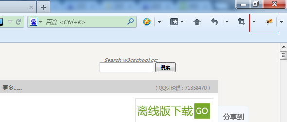

## Firebug 组件

### Firebug 选项

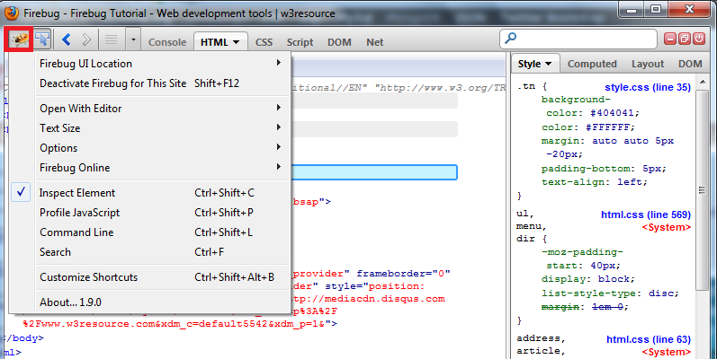

### 在页面上点击检查元素

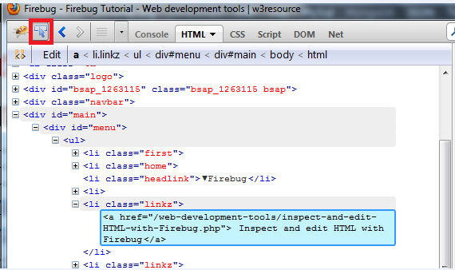

### 撤销与恢复

### 显示命令行

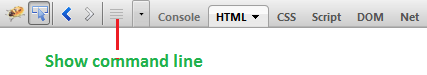

### 面板选择

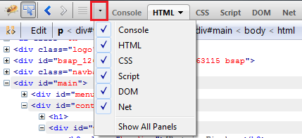

### 控制台

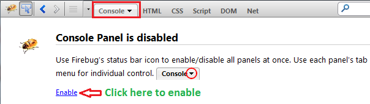

### HTML 面板

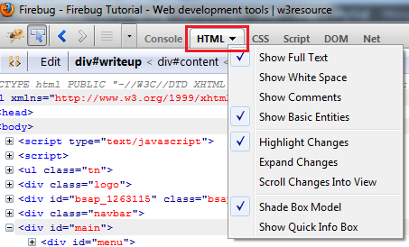

### CSS 面板

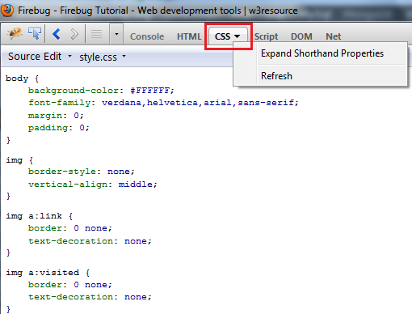

### 脚本面板

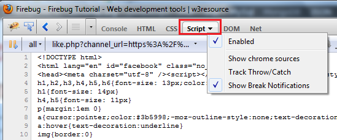

### DOM 面板

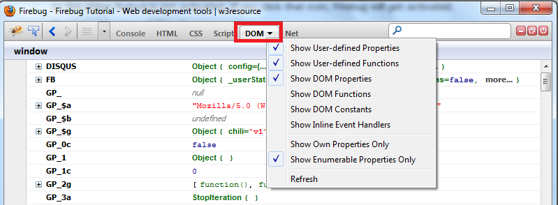

### 网络面板 (用于网页测速和优化)

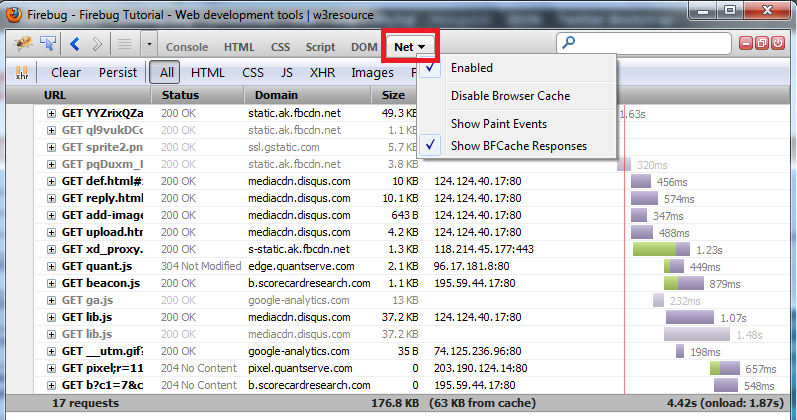

### 其他按钮

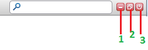

*   1 - 最小化Firebug。
*   2 - 在浏览器窗口安装Firebug。
*   3 - 停用Firebug。
