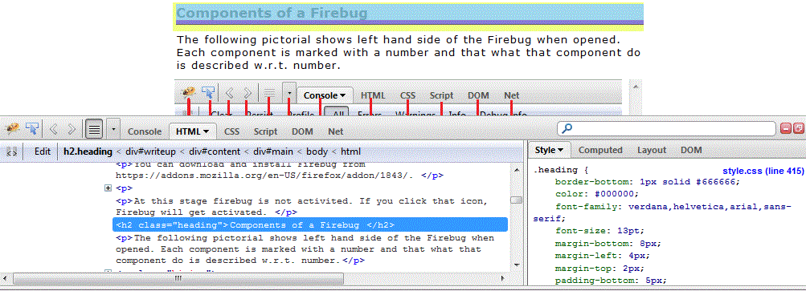
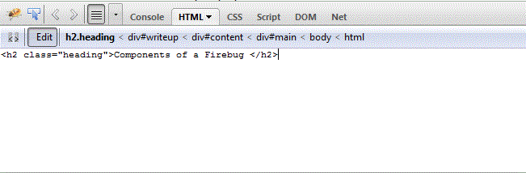
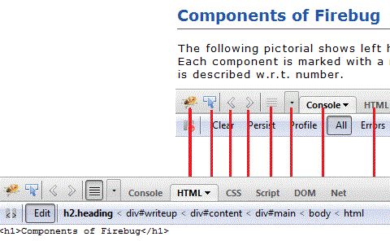
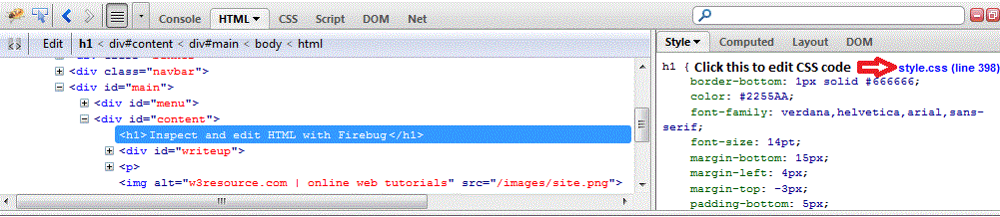
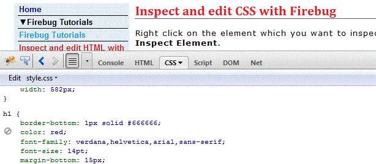

# 使用Firebug查看和编辑HTML和CSS

## 描述

在本章节的教程中，我们将讨论如何使用Firebug查看和编辑HTML和CSS。

## 使用Firebug查看和编辑HTML

在你要查看的元素上右击鼠标然后点 **Inspect Element(查看元素)**.

现在在Firebug窗口上点击**Edit（编辑）** 。

修改代码 &lt;h1&gt;Components of Firebug&lt;/h1&gt; .

你只要在Firebug窗口上修改代码就能实时的查看修改后代码在浏览器上的显示效果，你也可以复制代码到你的HTML文件中。

## 使用Firebug查看和编辑Css

鼠标右击你要查看的元素然后点击**Inspect Element(查看元素)**。如下图所示点击样式文件

通过修改代码为 **color:red;** 来修改标题颜色

修改完成后你可以马上看到修改后的效果。

现在你可以复制修改后的样式，取代原有的代码并保存，使之生效：

