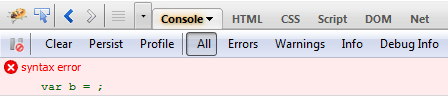
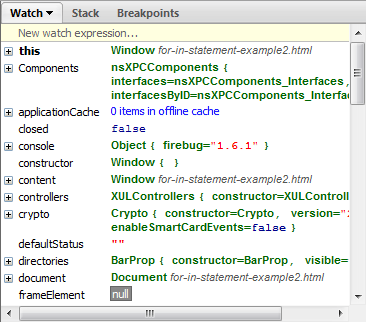
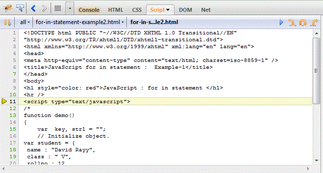
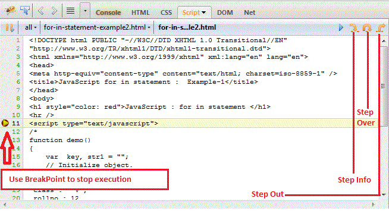
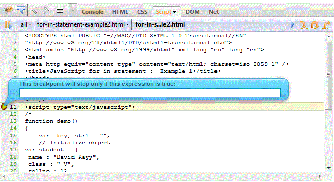

# 使用 Firebug 调试 JavaScript

## 描述

Firebug是一个非常强大的工具，可以帮助您发现代码发现错误的错误并解决错误。

在此我们使用Firebug来处理Javascript代码。

首先我们需要加载页面并打开Firebug。

有时候您需要重新载入页面。

## 在状态栏的错误数

## 显示当前页面的错误

## 显示错误的详细信息

## 一步步调试代码

### 你可以一步步的执行代码。这对代码调试非常有用。

### 使用断点调试

断点调试可以终止代码的执行，你可以通过指定代码范围来查看错误是不是在指定代码范围内。这对于 错误调试很有用。

如果你点击"Step over（单步跳过）" 按钮, Firebug 会更新所有变量直到你在右侧窗口中终止断点执行。

### 使用表达式让断点工作

你可以写一个表达式，在条件为真时，断点会停止代码的执行。

### 搜索

你可以使用快速搜索来查找代码中的关键字。

