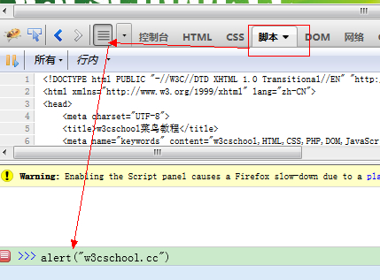
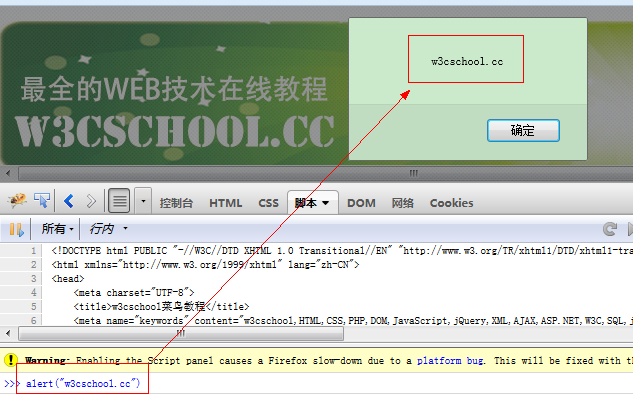

# Firebug动态执行JavaScript

您可以使用Firebug来编写并实时执行一个JavaScript。

这是为了测试，并确保该脚本工作正常，这是将JavaScript代码部署在生产环境前的好方法。

打开Firebug &gt; Script(脚本) &gt; 显示命令行，代码如下所示：

```
alert("w3cschool.cc")

```



按Enter键后，马上你就能看到代码的输出。如图所示：


