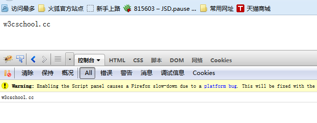

# Firebug记录Javascript日志

你可以使用Firebug来生成日志。

这有助于我们调试web页面并发现页面的错误。

在Firefox浏览器中执行以下代码：

```
<!DOCTYPE HTML PUBLIC "-//W3C//DTD HTML 4.01//EN" "http://www.w3.org/TR/html4/strict.dtd">
<html>
<head>
<meta http-equiv="Content-Type" content="text/html; charset=UTF-8">
<title>Firefox测试页面 - w3cschool菜鸟教程</title>
</head>
<body>
<script type="text/javascript">
var a = "w3cschool";
var b = ".cc";

document.write(a,b);
console.log(a + b);
</script>
</body>
</html>

```

使用Firefox浏览器打开以上代码文件firefox-test.html,执行结果及日志记录如下：


