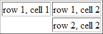

# HTML 表格


**你可以使用 HTML 创建表格。**

## 实例

[表格](/tiy/t.asp?f=html_tables)

```
&lt;html&gt;

&lt;body&gt;

&lt;p&gt;每个表格由 table 标签开始。&lt;/p&gt;
&lt;p&gt;每个表格行由 tr 标签开始。&lt;/p&gt;
&lt;p&gt;每个表格数据由 td 标签开始。&lt;/p&gt;

&lt;h4&gt;一列：&lt;/h4&gt;
&lt;table border="1"&gt;
&lt;tr&gt;
  &lt;td&gt;100&lt;/td&gt;
&lt;/tr&gt;
&lt;/table&gt;

&lt;h4&gt;一行三列：&lt;/h4&gt;
&lt;table border="1"&gt;
&lt;tr&gt;
  &lt;td&gt;100&lt;/td&gt;
  &lt;td&gt;200&lt;/td&gt;
  &lt;td&gt;300&lt;/td&gt;
&lt;/tr&gt;
&lt;/table&gt;

&lt;h4&gt;两行三列：&lt;/h4&gt;
&lt;table border="1"&gt;
&lt;tr&gt;
  &lt;td&gt;100&lt;/td&gt;
  &lt;td&gt;200&lt;/td&gt;
  &lt;td&gt;300&lt;/td&gt;
&lt;/tr&gt;
&lt;tr&gt;
  &lt;td&gt;400&lt;/td&gt;
  &lt;td&gt;500&lt;/td&gt;
  &lt;td&gt;600&lt;/td&gt;
&lt;/tr&gt;
&lt;/table&gt;

&lt;/body&gt;
&lt;/html&gt;

```

[表格边框](/tiy/t.asp?f=html_table_borders)

```
&lt;html&gt;

&lt;body&gt;

&lt;h4&gt;带有普通的边框：&lt;/h4&gt;  
&lt;table border="1"&gt;
&lt;tr&gt;
  &lt;td&gt;First&lt;/td&gt;
  &lt;td&gt;Row&lt;/td&gt;
&lt;/tr&gt;   
&lt;tr&gt;
  &lt;td&gt;Second&lt;/td&gt;
  &lt;td&gt;Row&lt;/td&gt;
&lt;/tr&gt;
&lt;/table&gt;

&lt;h4&gt;带有粗的边框：&lt;/h4&gt;  
&lt;table border="8"&gt;
&lt;tr&gt;
  &lt;td&gt;First&lt;/td&gt;
  &lt;td&gt;Row&lt;/td&gt;
&lt;/tr&gt;   
&lt;tr&gt;
  &lt;td&gt;Second&lt;/td&gt;
  &lt;td&gt;Row&lt;/td&gt;
&lt;/tr&gt;
&lt;/table&gt;

&lt;h4&gt;带有很粗的边框：&lt;/h4&gt;  
&lt;table border="15"&gt;
&lt;tr&gt;
  &lt;td&gt;First&lt;/td&gt;
  &lt;td&gt;Row&lt;/td&gt;
&lt;/tr&gt;   
&lt;tr&gt;
  &lt;td&gt;Second&lt;/td&gt;
  &lt;td&gt;Row&lt;/td&gt;
&lt;/tr&gt;
&lt;/table&gt;

&lt;/body&gt;
&lt;/html&gt;

```

（[可以在本页底端找到更多实例](#more_examples)。）

## 表格

表格由 &lt;table&gt; 标签来定义。每个表格均有若干行（由 &lt;tr&gt; 标签定义），每行被分割为若干单元格（由 &lt;td&gt; 标签定义）。字母 td 指表格数据（table data），即数据单元格的内容。数据单元格可以包含文本、图片、列表、段落、表单、水平线、表格等等。

```
<table border="1">
<tr>
<td>row 1, cell 1</td>
<td>row 1, cell 2</td>
</tr>
<tr>
<td>row 2, cell 1</td>
<td>row 2, cell 2</td>
</tr>
</table>
```

在浏览器显示如下：

<table border="1" style="margin-top:15px;">

<tbody>

<tr><td>row 1, cell 1</td><td>row 1, cell 2</td></tr>

<tr><td>row 2, cell 1</td><td>row 2, cell 2</td></tr>

</tbody>

</table>

## 表格和边框属性

如果不定义边框属性，表格将不显示边框。有时这很有用，但是大多数时候，我们希望显示边框。

使用边框属性来显示一个带有边框的表格：

```
<table border="1">
<tr>
<td>Row 1, cell 1</td>
<td>Row 1, cell 2</td>
</tr>
</table>
```

## 表格的表头

表格的表头使用 &lt;th&gt; 标签进行定义。

大多数浏览器会把表头显示为粗体居中的文本：

```
<table border="1">
<tr>
<th>Heading</th>
<th>Another Heading</th>
</tr>
<tr>
<td>row 1, cell 1</td>
<td>row 1, cell 2</td>
</tr>
<tr>
<td>row 2, cell 1</td>
<td>row 2, cell 2</td>
</tr>
</table>
```

在浏览器显示如下：

<table border="1" style="margin-top:15px;">

<tbody>

<tr><th>Heading</th><th>Another Heading</th></tr>

<tr><td>row 1, cell 1</td><td>row 1, cell 2</td></tr>

<tr><td>row 2, cell 1</td><td>row 2, cell 2</td></tr>

</tbody>

</table>

## 表格中的空单元格

在一些浏览器中，没有内容的表格单元显示得不太好。如果某个单元格是空的（没有内容），浏览器可能无法显示出这个单元格的边框。

```
<table border="1">
<tr>
<td>row 1, cell 1</td>
<td>row 1, cell 2</td>
</tr>
<tr>
<td></td>
<td>row 2, cell 2</td>
</tr>
</table>
```

浏览器可能会这样显示：



注意：这个空的单元格的边框没有被显示出来。为了避免这种情况，在空单元格中添加一个空格占位符，就可以将边框显示出来。

```
<table border="1">
<tr>
<td>row 1, cell 1</td>
<td>row 1, cell 2</td>
</tr>
<tr>
<td>&nbsp;</td>
<td>row 2, cell 2</td>
</tr>
</table>
```

在浏览器中显示如下：

<table border="1" style="margin-top:15px;">

<tbody>

<tr><td>row 1, cell 1</td><td>row 1, cell 2</td></tr>

<tr><td>row 2, cell 2</td></tr>

</tbody>

</table>

## &lt;a id="more_examples"&gt;更多实例&lt;/a&gt;

[没有边框的表格](/tiy/t.asp?f=html_tables2)

```
&lt;html&gt;

&lt;body&gt;

&lt;h4&gt;这个表格没有边框：&lt;/h4&gt;
&lt;table&gt;
&lt;tr&gt;
  &lt;td&gt;100&lt;/td&gt;
  &lt;td&gt;200&lt;/td&gt;
  &lt;td&gt;300&lt;/td&gt;
&lt;/tr&gt;
&lt;tr&gt;
  &lt;td&gt;400&lt;/td&gt;
  &lt;td&gt;500&lt;/td&gt;
  &lt;td&gt;600&lt;/td&gt;
&lt;/tr&gt;
&lt;/table&gt;

&lt;h4&gt;这个表格也没有边框：&lt;/h4&gt;
&lt;table border="0"&gt;
&lt;tr&gt;
  &lt;td&gt;100&lt;/td&gt;
  &lt;td&gt;200&lt;/td&gt;
  &lt;td&gt;300&lt;/td&gt;
&lt;/tr&gt;
&lt;tr&gt;
  &lt;td&gt;400&lt;/td&gt;
  &lt;td&gt;500&lt;/td&gt;
  &lt;td&gt;600&lt;/td&gt;
&lt;/tr&gt;
&lt;/table&gt;

&lt;/body&gt;
&lt;/html&gt;

```

[表格中的表头(Heading)](/tiy/t.asp?f=html_table_headers)

```
&lt;html&gt;

&lt;body&gt;

&lt;h4&gt;表头：&lt;/h4&gt;
&lt;table border="1"&gt;
&lt;tr&gt;
  &lt;th&gt;姓名&lt;/th&gt;
  &lt;th&gt;电话&lt;/th&gt;
  &lt;th&gt;电话&lt;/th&gt;
&lt;/tr&gt;
&lt;tr&gt;
  &lt;td&gt;Bill Gates&lt;/td&gt;
  &lt;td&gt;555 77 854&lt;/td&gt;
  &lt;td&gt;555 77 855&lt;/td&gt;
&lt;/tr&gt;
&lt;/table&gt;

&lt;h4&gt;垂直的表头：&lt;/h4&gt;
&lt;table border="1"&gt;
&lt;tr&gt;
  &lt;th&gt;姓名&lt;/th&gt;
  &lt;td&gt;Bill Gates&lt;/td&gt;
&lt;/tr&gt;
&lt;tr&gt;
  &lt;th&gt;电话&lt;/th&gt;
  &lt;td&gt;555 77 854&lt;/td&gt;
&lt;/tr&gt;
&lt;tr&gt;
  &lt;th&gt;电话&lt;/th&gt;
  &lt;td&gt;555 77 855&lt;/td&gt;
&lt;/tr&gt;
&lt;/table&gt;

&lt;/body&gt;
&lt;/html&gt;

```

[空单元格](/tiy/t.asp?f=html_table_nbsp)

```
&lt;html&gt;

&lt;body&gt;

&lt;table border="1"&gt;
&lt;tr&gt;
  &lt;td&gt;Some text&lt;/td&gt;
  &lt;td&gt;Some text&lt;/td&gt;
&lt;/tr&gt;
&lt;tr&gt;
  &lt;td&gt;&lt;/td&gt;
  &lt;td&gt;Some text&lt;/td&gt;
&lt;/tr&gt;
&lt;/table&gt;

&lt;p&gt;正如您看到的，其中一个单元没有边框。这是因为它是空的。在该单元中插入一个空格后，仍然没有边框。&lt;/p&gt;

&lt;p&gt;我们的技巧是在单元中插入一个 no-breaking 空格。&lt;/p&gt;

&lt;p&gt;no-breaking 空格是一个字符实体。如果您不清楚什么是字符实体，请阅读关于字符实体的章节。&lt;/p&gt;

&lt;p&gt;no-breaking 空格由和号开始 ("&")，然后是字符"nbsp"，并以分号结尾(";")。&lt;/p&gt;

&lt;/body&gt;
&lt;/html&gt;

```

[带有标题的表格](/tiy/t.asp?f=html_tables3)

```
&lt;html&gt;

&lt;body&gt;

&lt;h4&gt;这个表格有一个标题，以及粗边框：&lt;/h4&gt;

&lt;table border="6"&gt;
&lt;caption&gt;我的标题&lt;/caption&gt;
&lt;tr&gt;
  &lt;td&gt;100&lt;/td&gt;
  &lt;td&gt;200&lt;/td&gt;
  &lt;td&gt;300&lt;/td&gt;
&lt;/tr&gt;
&lt;tr&gt;
  &lt;td&gt;400&lt;/td&gt;
  &lt;td&gt;500&lt;/td&gt;
  &lt;td&gt;600&lt;/td&gt;
&lt;/tr&gt;
&lt;/table&gt;

&lt;/body&gt;

```

[跨行或跨列的表格单元格](/tiy/t.asp?f=html_table_span)

```
&lt;html&gt;

&lt;body&gt;

&lt;h4&gt;横跨两列的单元格：&lt;/h4&gt;
&lt;table border="1"&gt;
&lt;tr&gt;
  &lt;th&gt;姓名&lt;/th&gt;
  &lt;th colspan="2"&gt;电话&lt;/th&gt;
&lt;/tr&gt;
&lt;tr&gt;
  &lt;td&gt;Bill Gates&lt;/td&gt;
  &lt;td&gt;555 77 854&lt;/td&gt;
  &lt;td&gt;555 77 855&lt;/td&gt;
&lt;/tr&gt;
&lt;/table&gt;

&lt;h4&gt;横跨两行的单元格：&lt;/h4&gt;
&lt;table border="1"&gt;
&lt;tr&gt;
  &lt;th&gt;姓名&lt;/th&gt;
  &lt;td&gt;Bill Gates&lt;/td&gt;
&lt;/tr&gt;
&lt;tr&gt;
  &lt;th rowspan="2"&gt;电话&lt;/th&gt;
  &lt;td&gt;555 77 854&lt;/td&gt;
&lt;/tr&gt;
&lt;tr&gt;
  &lt;td&gt;555 77 855&lt;/td&gt;
&lt;/tr&gt;
&lt;/table&gt;

&lt;/body&gt;
&lt;/html&gt;

```

[表格内的标签](/tiy/t.asp?f=html_table_elements)

```
&lt;html&gt;

&lt;body&gt;

&lt;table border="1"&gt;
&lt;tr&gt;
  &lt;td&gt;
   &lt;p&gt;这是一个段落。&lt;/p&gt;
   &lt;p&gt;这是另一个段落。&lt;/p&gt;
  &lt;/td&gt;
  &lt;td&gt;这个单元包含一个表格：
   &lt;table border="1"&gt;
   &lt;tr&gt;
     &lt;td&gt;A&lt;/td&gt;
     &lt;td&gt;B&lt;/td&gt;
   &lt;/tr&gt;
   &lt;tr&gt;
     &lt;td&gt;C&lt;/td&gt;
     &lt;td&gt;D&lt;/td&gt;
   &lt;/tr&gt;
   &lt;/table&gt;
  &lt;/td&gt;
&lt;/tr&gt;
&lt;tr&gt;
  &lt;td&gt;这个单元包含一个列表：
   &lt;ul&gt;
    &lt;li&gt;苹果&lt;/li&gt;
    &lt;li&gt;香蕉&lt;/li&gt;
    &lt;li&gt;菠萝&lt;/li&gt;
   &lt;/ul&gt;
  &lt;/td&gt;
  &lt;td&gt;HELLO&lt;/td&gt;
&lt;/tr&gt;
&lt;/table&gt;

&lt;/body&gt;
&lt;/html&gt;

```

[单元格边距(Cell padding)](/tiy/t.asp?f=html_table_cellpadding)

```
&lt;html&gt;

&lt;body&gt;

&lt;h4&gt;没有 cellpadding：&lt;/h4&gt;
&lt;table border="1"&gt;
&lt;tr&gt;
  &lt;td&gt;First&lt;/td&gt;
  &lt;td&gt;Row&lt;/td&gt;
&lt;/tr&gt;   
&lt;tr&gt;
  &lt;td&gt;Second&lt;/td&gt;
  &lt;td&gt;Row&lt;/td&gt;
&lt;/tr&gt;
&lt;/table&gt;

&lt;h4&gt;带有 cellpadding：&lt;/h4&gt;
&lt;table border="1"
cellpadding="10"&gt;
&lt;tr&gt;
  &lt;td&gt;First&lt;/td&gt;
  &lt;td&gt;Row&lt;/td&gt;
&lt;/tr&gt;   
&lt;tr&gt;
  &lt;td&gt;Second&lt;/td&gt;
  &lt;td&gt;Row&lt;/td&gt;
&lt;/tr&gt;
&lt;/table&gt;

&lt;/body&gt;
&lt;/html&gt;

```

[单元格间距(Cell spacing)](/tiy/t.asp?f=html_table_cellspacing)

```
&lt;html&gt;

&lt;body&gt;

&lt;h4&gt;没有 cellspacing：&lt;/h4&gt;
&lt;table border="1"&gt;
&lt;tr&gt;
  &lt;td&gt;First&lt;/td&gt;
  &lt;td&gt;Row&lt;/td&gt;
&lt;/tr&gt;   
&lt;tr&gt;
  &lt;td&gt;Second&lt;/td&gt;
  &lt;td&gt;Row&lt;/td&gt;
&lt;/tr&gt;
&lt;/table&gt;

&lt;h4&gt;带有 cellspacing：&lt;/h4&gt;
&lt;table border="1"
cellspacing="10"&gt;
&lt;tr&gt;
  &lt;td&gt;First&lt;/td&gt;
  &lt;td&gt;Row&lt;/td&gt;
&lt;/tr&gt;   
&lt;tr&gt;
  &lt;td&gt;Second&lt;/td&gt;
  &lt;td&gt;Row&lt;/td&gt;
&lt;/tr&gt;
&lt;/table&gt;

&lt;/body&gt;
&lt;/html&gt;

```

[向表格添加背景颜色或背景图像](/tiy/t.asp?f=html_table_background)

```
&lt;html&gt;

&lt;body&gt;

&lt;h4&gt;背景颜色：&lt;/h4&gt;
&lt;table border="1"
bgcolor="red"&gt;
&lt;tr&gt;
  &lt;td&gt;First&lt;/td&gt;
  &lt;td&gt;Row&lt;/td&gt;
&lt;/tr&gt;   
&lt;tr&gt;
  &lt;td&gt;Second&lt;/td&gt;
  &lt;td&gt;Row&lt;/td&gt;
&lt;/tr&gt;
&lt;/table&gt;

&lt;h4&gt;背景图像：&lt;/h4&gt;
&lt;table border="1"
background="/i/eg_bg_07.gif"&gt;
&lt;tr&gt;
  &lt;td&gt;First&lt;/td&gt;
  &lt;td&gt;Row&lt;/td&gt;
&lt;/tr&gt;   
&lt;tr&gt;
  &lt;td&gt;Second&lt;/td&gt;
  &lt;td&gt;Row&lt;/td&gt;
&lt;/tr&gt;
&lt;/table&gt;

&lt;/body&gt;
&lt;/html&gt;

```

[向表格单元添加背景颜色或者背景图像](/tiy/t.asp?f=html_table_cellbackground)

```
&lt;html&gt;

&lt;body&gt;

&lt;h4&gt;单元背景：&lt;/h4&gt;  
&lt;table border="1"&gt;
&lt;tr&gt;
  &lt;td bgcolor="red"&gt;First&lt;/td&gt;
  &lt;td&gt;Row&lt;/td&gt;
&lt;/tr&gt;   
&lt;tr&gt;
  &lt;td
  background="/i/eg_bg_07.gif"&gt;
  Second&lt;/td&gt;
  &lt;td&gt;Row&lt;/td&gt;
&lt;/tr&gt;
&lt;/table&gt;

&lt;/body&gt;
&lt;/html&gt;

```

[在表格单元中排列内容](/tiy/t.asp?f=html_table_align)

```
&lt;html&gt;

&lt;body&gt;

&lt;table width="400" border="1"&gt;
 &lt;tr&gt;
  &lt;th align="left"&gt;消费项目....&lt;/th&gt;
  &lt;th align="right"&gt;一月&lt;/th&gt;
  &lt;th align="right"&gt;二月&lt;/th&gt;
 &lt;/tr&gt;
 &lt;tr&gt;
  &lt;td align="left"&gt;衣服&lt;/td&gt;
  &lt;td align="right"&gt;$241.10&lt;/td&gt;
  &lt;td align="right"&gt;$50.20&lt;/td&gt;
 &lt;/tr&gt;
 &lt;tr&gt;
  &lt;td align="left"&gt;化妆品&lt;/td&gt;
  &lt;td align="right"&gt;$30.00&lt;/td&gt;
  &lt;td align="right"&gt;$44.45&lt;/td&gt;
 &lt;/tr&gt;
 &lt;tr&gt;
  &lt;td align="left"&gt;食物&lt;/td&gt;
  &lt;td align="right"&gt;$730.40&lt;/td&gt;
  &lt;td align="right"&gt;$650.00&lt;/td&gt;
 &lt;/tr&gt;
 &lt;tr&gt;
  &lt;th align="left"&gt;总计&lt;/th&gt;
  &lt;th align="right"&gt;$1001.50&lt;/th&gt;
  &lt;th align="right"&gt;$744.65&lt;/th&gt;
 &lt;/tr&gt;
&lt;/table&gt;

&lt;/body&gt;
&lt;/html&gt;

```

[框架(frame)属性](/tiy/t.asp?f=html_table_frame)

```
&lt;html&gt;
&lt;body&gt;

&lt;p&gt;&lt;b&gt;注释：&lt;/b&gt;frame 属性无法在 Internet Explorer 中正确地显示。&lt;/p&gt;

&lt;p&gt;Table with frame="box":&lt;/p&gt;
&lt;table frame="box"&gt;
  &lt;tr&gt;
    &lt;th&gt;Month&lt;/th&gt;
    &lt;th&gt;Savings&lt;/th&gt;
  &lt;/tr&gt;
  &lt;tr&gt;
    &lt;td&gt;January&lt;/td&gt;
    &lt;td&gt;$100&lt;/td&gt;
  &lt;/tr&gt;
&lt;/table&gt;

&lt;p&gt;Table with frame="above":&lt;/p&gt;
&lt;table frame="above"&gt;
  &lt;tr&gt;
    &lt;th&gt;Month&lt;/th&gt;
    &lt;th&gt;Savings&lt;/th&gt;
  &lt;/tr&gt;
  &lt;tr&gt;
    &lt;td&gt;January&lt;/td&gt;
    &lt;td&gt;$100&lt;/td&gt;
  &lt;/tr&gt;
&lt;/table&gt;

&lt;p&gt;Table with frame="below":&lt;/p&gt;
&lt;table frame="below"&gt;
  &lt;tr&gt;
    &lt;th&gt;Month&lt;/th&gt;
    &lt;th&gt;Savings&lt;/th&gt;
  &lt;/tr&gt;
  &lt;tr&gt;
    &lt;td&gt;January&lt;/td&gt;
    &lt;td&gt;$100&lt;/td&gt;
  &lt;/tr&gt;
&lt;/table&gt;

&lt;p&gt;Table with frame="hsides":&lt;/p&gt;
&lt;table frame="hsides"&gt;
  &lt;tr&gt;
    &lt;th&gt;Month&lt;/th&gt;
    &lt;th&gt;Savings&lt;/th&gt;
  &lt;/tr&gt;
  &lt;tr&gt;
    &lt;td&gt;January&lt;/td&gt;
    &lt;td&gt;$100&lt;/td&gt;
  &lt;/tr&gt;
&lt;/table&gt;

&lt;p&gt;Table with frame="vsides":&lt;/p&gt;
&lt;table frame="vsides"&gt;
  &lt;tr&gt;
    &lt;th&gt;Month&lt;/th&gt;
    &lt;th&gt;Savings&lt;/th&gt;
  &lt;/tr&gt;
  &lt;tr&gt;
    &lt;td&gt;January&lt;/td&gt;
    &lt;td&gt;$100&lt;/td&gt;
  &lt;/tr&gt;
&lt;/table&gt;

&lt;/body&gt;
&lt;/html&gt;

```

## 表格标签

| 表格 | 描述 |
| --- | --- |
| [`<table>`](/tags/tag_table.asp) | 定义表格 |
| [`<caption>`](/tags/tag_caption.asp) | 定义表格标题。 |
| [`<th>`](/tags/tag_th.asp) | 定义表格的表头。 |
| [`<tr>`](/tags/tag_tr.asp) | 定义表格的行。 |
| [`<td>`](/tags/tag_td.asp) | 定义表格单元。 |
| [`<thead>`](/tags/tag_thead.asp) | 定义表格的页眉。 |
| [`<tbody>`](/tags/tag_tbody.asp) | 定义表格的主体。 |
| [`<tfoot>`](/tags/tag_tfoot.asp) | 定义表格的页脚。 |
| [`<col>`](/tags/tag_col.asp) | 定义用于表格列的属性。 |
| [`<colgroup>`](/tags/tag_colgroup.asp) | 定义表格列的组。 |


