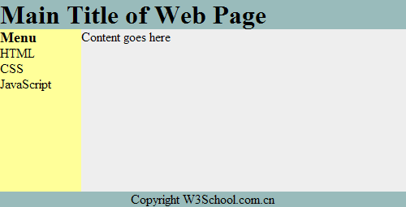

# HTML 布局


**网页布局对改善网站的外观非常重要。**

**请慎重设计您的网页布局。**

## 亲自试一试 - 实例

[使用 &lt;div&gt; 元素的网页布局](/tiy/t.asp?f=html_layout_divs)

```
&lt;!DOCTYPE html&gt;
&lt;html&gt;
&lt;head&gt;
&lt;style type="text/css"&gt;
div#container{width:500px}
div#header {background-color:#99bbbb;}
div#menu {background-color:#ffff99;height:200px;width:150px;float:left;}
div#content {background-color:#EEEEEE;height:200px;width:350px;float:left;}
div#footer {background-color:#99bbbb;clear:both;text-align:center;}
h1 {margin-bottom:0;}
h2 {margin-bottom:0;font-size:18px;}
ul {margin:0;}
li {list-style:none;}
&lt;/style&gt;
&lt;/head&gt;

&lt;body&gt;

&lt;div id="container"&gt;

&lt;div id="header"&gt;
&lt;h1&gt;Main Title of Web Page&lt;/h1&gt;
&lt;/div&gt;

&lt;div id="menu"&gt;
&lt;h2&gt;Menu&lt;/h2&gt;
&lt;ul&gt;
&lt;li&gt;HTML&lt;/li&gt;
&lt;li&gt;CSS&lt;/li&gt;
&lt;li&gt;JavaScript&lt;/li&gt;
&lt;/ul&gt;
&lt;/div&gt;

&lt;div id="content"&gt;Content goes here&lt;/div&gt;

&lt;div id="footer"&gt;Copyright W3School.com.cn&lt;/div&gt;

&lt;/div&gt;

&lt;/body&gt;
&lt;/html&gt;

```

[使用 &lt;table&gt; 元素的网页布局](/tiy/t.asp?f=html_layout_tables)

```
&lt;!DOCTYPE html&gt;
&lt;html&gt;
&lt;body&gt;

&lt;table width="500" border="0"&gt;
&lt;tr&gt;
&lt;td colspan="2" style="background-color:#99bbbb;"&gt;
&lt;h1&gt;Main Title of Web Page&lt;/h1&gt;
&lt;/td&gt;
&lt;/tr&gt;

&lt;tr valign="top"&gt;
&lt;td style="background-color:#ffff99;width:100px;text-align:top;"&gt;
&lt;b&gt;Menu&lt;/b&gt;&lt;br /&gt;
HTML&lt;br /&gt;
CSS&lt;br /&gt;
JavaScript
&lt;/td&gt;
&lt;td style="background-color:#EEEEEE;height:200px;width:400px;text-align:top;"&gt;
Content goes here&lt;/td&gt;
&lt;/tr&gt;

&lt;tr&gt;
&lt;td colspan="2" style="background-color:#99bbbb;text-align:center;"&gt;
Copyright W3School.com.cn&lt;/td&gt;
&lt;/tr&gt;
&lt;/table&gt;

&lt;/body&gt;
&lt;/html&gt;

```

## 网站布局

大多数网站会把内容安排到多个列中（就像杂志或报纸那样）。

可以使用 &lt;div&gt; 或者 &lt;table&gt; 元素来创建多列。CSS 用于对元素进行定位，或者为页面创建背景以及色彩丰富的外观。

提示：即使可以使用 HTML 表格来创建漂亮的布局，但设计表格的目的是呈现表格化数据 - 表格不是布局工具！

## HTML 布局 - 使用 &lt;div&gt; 元素

div 元素是用于分组 HTML 元素的块级元素。

下面的例子使用五个 div 元素来创建多列布局：

### 实例

```
<!DOCTYPE html>
<html>
<head>
<style type="text/css">
div#container{width:500px}
div#header {background-color:#99bbbb;}
div#menu {background-color:#ffff99; height:200px; width:100px; float:left;}
div#content {background-color:#EEEEEE; height:200px; width:400px; float:left;}
div#footer {background-color:#99bbbb; clear:both; text-align:center;}
h1 {margin-bottom:0;}
h2 {margin-bottom:0; font-size:14px;}
ul {margin:0;}
li {list-style:none;}
</style>
</head>

<body>

<div id="container">

<div id="header">
<h1>Main Title of Web Page</h1>
</div>

<div id="menu">
<h2>Menu</h2>
<ul>
<li>HTML</li>
<li>CSS</li>
<li>JavaScript</li>
</ul>
</div>

<div id="content">Content goes here</div>

<div id="footer">Copyright W3School.com.cn</div>

</div>

</body>
</html>

```


上面的 HTML 代码会产生如下结果：



## HTML 布局 - 使用表格

使用 HTML &lt;table&gt; 标签是创建布局的一种简单的方式。

可以使用 &lt;div&gt; 或者 &lt;table&gt; 元素来创建多列。CSS 用于对元素进行定位，或者为页面创建背景以及色彩丰富的外观。

提示：即使可以使用 HTML 表格来创建漂亮的布局，但设计表格的目的是呈现表格化数据 - 表格不是布局工具！

下面的例子使用三行两列的表格 - 第一和最后一行使用 colspan 属性来横跨两列：

### 实例

```
<!DOCTYPE html>
<html>
<body>

<table width="500" border="0">
<tr>
<td colspan="2" style="background-color:#99bbbb;">
<h1>Main Title of Web Page</h1>
</td>
</tr>

<tr valign="top">
<td style="background-color:#ffff99;width:100px;text-align:top;">
<b>Menu</b><br />
HTML<br />
CSS<br />
JavaScript
</td>
<td style="background-color:#EEEEEE;height:200px;width:400px;text-align:top;">
Content goes here</td>
</tr>

<tr>
<td colspan="2" style="background-color:#99bbbb;text-align:center;">
Copyright W3School.com.cn</td>
</tr>
</table>

</body>
</html>

```


上面的 HTML 代码会产生以下结果：


## HTML 布局 - 有用的提示

提示：使用 CSS 最大的好处是，如果把 CSS 代码存放到外部样式表中，那么站点会更易于维护。通过编辑单一的文件，就可以改变所有页面的布局。如需学习更多有关 CSS 的知识，请访问我们的 [CSS 教程](/css/index.asp "CSS 教程")。

提示：由于创建高级的布局非常耗时，使用模板是一个快速的选项。通过搜索引擎可以找到很多免费的网站模板（您可以使用这些预先构建好的网站布局，并优化它们）。

## HTML 布局标签

| 标签 | 描述 |
| --- | --- |
| [`<div>`](/tags/tag_div.asp "HTML <div> 标签") | 定义文档中的分区或节（division/section）。 |
| [`<span>`](/tags/tag_span.asp "HTML <span> 标签") | 定义 span，用来组合文档中的行内元素。 |


