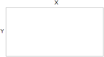
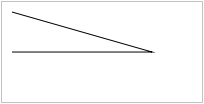
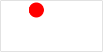
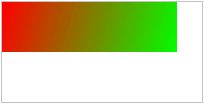

# HTML 5 Canvas


**canvas 元素用于在网页上绘制图形。**

## 什么是 Canvas？

HTML5 的 canvas 元素使用 JavaScript 在网页上绘制图像。

画布是一个矩形区域，您可以控制其每一像素。

canvas 拥有多种绘制路径、矩形、圆形、字符以及添加图像的方法。

## 创建 Canvas 元素

向 HTML5 页面添加 canvas 元素。

规定元素的 id、宽度和高度：

```
<canvas id="myCanvas" width="200" height="100"></canvas>
```

## 通过 JavaScript 来绘制

canvas 元素本身是没有绘图能力的。所有的绘制工作必须在 JavaScript 内部完成：

```
<script type="text/javascript">
var c=document.getElementById("myCanvas");
var cxt=c.getContext("2d");
cxt.fillStyle="#FF0000";
cxt.fillRect(0,0,150,75);
</script>

```

JavaScript 使用 id 来寻找 canvas 元素：

```
var c=document.getElementById("myCanvas");
```

然后，创建 context 对象：

```
var cxt=c.getContext("2d"); 
```

getContext("2d") 对象是内建的 HTML5 对象，拥有多种绘制路径、矩形、圆形、字符以及添加图像的方法。

下面的两行代码绘制一个红色的矩形：

```
cxt.fillStyle="#FF0000";
cxt.fillRect(0,0,150,75); 

```

fillStyle 方法将其染成红色，fillRect 方法规定了形状、位置和尺寸。

## 理解坐标

上面的 fillRect 方法拥有参数 (0,0,150,75)。

意思是：在画布上绘制 150x75 的矩形，从左上角开始 (0,0)。

如下图所示，画布的 X 和 Y 坐标用于在画布上对绘画进行定位。



[实例：把鼠标悬停在矩形上可以看到坐标](/tiy/t.asp?f=html5_canvas_coordinates)

## 更多 Canvas 实例

下面的在 canvas 元素上进行绘画的更多实例：

### 实例 - 线条

通过指定从何处开始，在何处结束，来绘制一条线：



JavaScript 代码：

```
<script type="text/javascript">

var c=document.getElementById("myCanvas");
var cxt=c.getContext("2d");
cxt.moveTo(10,10);
cxt.lineTo(150,50);
cxt.lineTo(10,50);
cxt.stroke();

</script>

```

canvas 元素：

```
<canvas id="myCanvas" width="200" height="100" style="border:1px solid #c3c3c3;">
Your browser does not support the canvas element.
</canvas>

```


### 实例 - 圆形

通过规定尺寸、颜色和位置，来绘制一个圆：



JavaScript 代码：

```
<script type="text/javascript">

var c=document.getElementById("myCanvas");
var cxt=c.getContext("2d");
cxt.fillStyle="#FF0000";
cxt.beginPath();
cxt.arc(70,18,15,0,Math.PI*2,true);
cxt.closePath();
cxt.fill();

</script>

```

canvas 元素：

```
<canvas id="myCanvas" width="200" height="100" style="border:1px solid #c3c3c3;">
Your browser does not support the canvas element.
</canvas>

```


### 实例 - 渐变

使用您指定的颜色来绘制渐变背景：



JavaScript 代码：

```
<script type="text/javascript">

var c=document.getElementById("myCanvas");
var cxt=c.getContext("2d");
var grd=cxt.createLinearGradient(0,0,175,50);
grd.addColorStop(0,"#FF0000");
grd.addColorStop(1,"#00FF00");
cxt.fillStyle=grd;
cxt.fillRect(0,0,175,50);

</script>

```

canvas 元素：

```
<canvas id="myCanvas" width="200" height="100" style="border:1px solid #c3c3c3;">
Your browser does not support the canvas element.
</canvas>

```


### 实例 - 图像

把一幅图像放置到画布上：


JavaScript 代码：

```
<script type="text/javascript">

var c=document.getElementById("myCanvas");
var cxt=c.getContext("2d");
var img=new Image()
img.src="flower.png"
cxt.drawImage(img,0,0);

</script>

```

canvas 元素：

```
<canvas id="myCanvas" width="200" height="100" style="border:1px solid #c3c3c3;">
Your browser does not support the canvas element.
</canvas>

```


## 相关页面

参考手册：[HTML 5 &lt;canvas&gt; 标签](/tags/tag_canvas.asp "HTML &lt;canvas&gt; 标签")

参考手册：[HTML DOM Canvas 对象](/jsref/dom_obj_canvas.asp "HTML DOM Canvas 对象")


