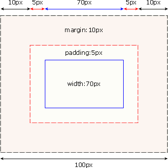

# CSS 框模型概述


**CSS 框模型 (Box Model) 规定了元素框处理元素内容、[内边距](/css/css_padding.asp "CSS 内边距")、[边框](/css/css_border.asp "CSS 边框") 和 [外边距](/css/css_margin.asp "CSS 外边距") 的方式。**

## CSS 框模型概述


元素框的最内部分是实际的内容，直接包围内容的是内边距。内边距呈现了元素的背景。内边距的边缘是边框。边框以外是外边距，外边距默认是透明的，因此不会遮挡其后的任何元素。

提示：背景应用于由内容和内边距、边框组成的区域。

内边距、边框和外边距都是可选的，默认值是零。但是，许多元素将由用户代理样式表设置外边距和内边距。可以通过将元素的 margin 和 padding 设置为零来覆盖这些浏览器样式。这可以分别进行，也可以使用通用选择器对所有元素进行设置：

```
* {
  margin: 0;
  padding: 0;
}

```

在 CSS 中，width 和 height 指的是内容区域的宽度和高度。增加内边距、边框和外边距不会影响内容区域的尺寸，但是会增加元素框的总尺寸。

假设框的每个边上有 10 个像素的外边距和 5 个像素的内边距。如果希望这个元素框达到 100 个像素，就需要将内容的宽度设置为 70 像素，请看下图：



```
#box {
  width: 70px;
  margin: 10px;
  padding: 5px;
}

```

提示：内边距、边框和外边距可以应用于一个元素的所有边，也可以应用于单独的边。

提示：外边距可以是负值，而且在很多情况下都要使用负值的外边距。

## 浏览器兼容性

一旦为页面设置了恰当的 DTD，大多数浏览器都会按照上面的图示来呈现内容。然而 IE 5 和 6 的呈现却是不正确的。根据 W3C 的规范，元素内容占据的空间是由 width 属性设置的，而内容周围的 padding 和 border 值是另外计算的。不幸的是，IE5.X 和 6 在怪异模式中使用自己的非标准模型。这些浏览器的 width 属性不是内容的宽度，而是内容、内边距和边框的宽度的总和。

虽然有方法解决这个问题。但是目前最好的解决方案是回避这个问题。也就是，不要给元素添加具有指定宽度的内边距，而是尝试将内边距或外边距添加到元素的父元素和子元素。

### 术语翻译

*   element : 元素。
*   padding : 内边距，也有资料将其翻译为填充。
*   border : 边框。
*   margin : 外边距，也有资料将其翻译为空白或空白边。

在 w3school，我们把 padding 和 margin 统一地称为内边距和外边距。边框内的空白是内边距，边框外的空白是外边距，很容易记吧：）


