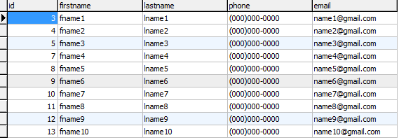
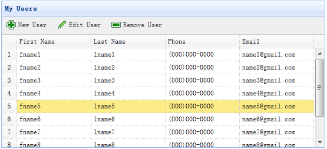
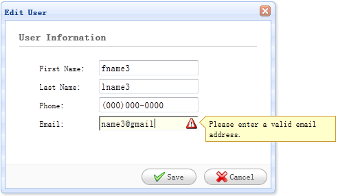
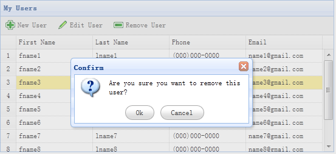

# jQuery EasyUI 应用 - 创建 CRUD 应用

数据收集并妥善管理数据是网络应用共同的必要。CRUD 允许我们生成页面列表，并编辑数据库记录。本教程将向你演示如何使用 jQuery EasyUI 框架实现一个 CRUD DataGrid。

我们将使用下面的插件：

*   datagrid：向用户展示列表数据。
*   dialog：创建或编辑一条单一的用户信息。
*   form：用于提交表单数据。
*   messager：显示一些操作信息。

#### 步骤 1：准备数据库

我们将使用 MySql 数据库来存储用户信息。创建数据库和 'users' 表。



#### 步骤 2：创建 DataGrid 来显示用户信息

创建没有 javascript 代码的 DataGrid。

```
<table id="dg" title="My Users" class="easyui-datagrid" style="width:550px;height:250px"
		url="get_users.php"
		toolbar="#toolbar"
		rownumbers="true" fitColumns="true" singleSelect="true">
	<thead>
		<tr>
			<th field="firstname" width="50">First Name</th>
			<th field="lastname" width="50">Last Name</th>
			<th field="phone" width="50">Phone</th>
			<th field="email" width="50">Email</th>
		</tr>
	</thead>
</table>
<div id="toolbar">
	<a href="#" class="easyui-linkbutton" iconCls="icon-add" plain="true" onclick="newUser()">New User</a>
	<a href="#" class="easyui-linkbutton" iconCls="icon-edit" plain="true" onclick="editUser()">Edit User</a>
	<a href="#" class="easyui-linkbutton" iconCls="icon-remove" plain="true" onclick="destroyUser()">Remove User</a>
</div>

```

我们不需要写任何的 javascript 代码，就能向用户显示列表，如下图所示：



DataGrid 使用 'url' 属性，并赋值为 'get_users.php'，用来从服务器检索数据。

get_users.php 文件的代码

```
$rs = mysql_query('select * from users');
$result = array();
while($row = mysql_fetch_object($rs)){
	array_push($result, $row);
}

echo json_encode($result);

```

#### 步骤 3：创建表单对话框

我们使用相同的对话框来创建或编辑用户。

```
<div id="dlg" class="easyui-dialog" style="width:400px;height:280px;padding:10px 20px"
		closed="true" buttons="#dlg-buttons">
	<div class="ftitle">User Information</div>
	<form id="fm" method="post">
		<div class="fitem">
			<label>First Name:</label>
			<input name="firstname" class="easyui-validatebox" required="true">
		</div>
		<div class="fitem">
			<label>Last Name:</label>
			<input name="lastname" class="easyui-validatebox" required="true">
		</div>
		<div class="fitem">
			<label>Phone:</label>
			<input name="phone">
		</div>
		<div class="fitem">
			<label>Email:</label>
			<input name="email" class="easyui-validatebox" validType="email">
		</div>
	</form>
</div>
<div id="dlg-buttons">
	<a href="#" class="easyui-linkbutton" iconCls="icon-ok" onclick="saveUser()">Save</a>
	<a href="#" class="easyui-linkbutton" iconCls="icon-cancel" onclick="javascript:$('#dlg').dialog('close')">Cancel</a>
</div>

```

这个对话框已经创建，也没有任何的 javascript 代码:。



#### 步骤 4：实现创建和编辑用户

当创建用户时，打开一个对话框并清空表单数据。

```
function newUser(){
	$('#dlg').dialog('open').dialog('setTitle','New User');
	$('#fm').form('clear');
	url = 'save_user.php';
}

```

当编辑用户时，打开一个对话框并从 datagrid 选择的行中加载表单数据。

```
var row = $('#dg').datagrid('getSelected');
if (row){
	$('#dlg').dialog('open').dialog('setTitle','Edit User');
	$('#fm').form('load',row);
	url = 'update_user.php?id='+row.id;
}

```

'url' 存储着当保存用户数据时表单回传的 URL 地址。

#### 步骤 5：保存用户数据

我们使用下面的代码保存用户数据：

```
function saveUser(){
	$('#fm').form('submit',{
		url: url,
		onSubmit: function(){
			return $(this).form('validate');
		},
		success: function(result){
			var result = eval('('+result+')');
			if (result.errorMsg){
				$.messager.show({
					title: 'Error',
					msg: result.errorMsg
				});
			} else {
				$('#dlg').dialog('close');		// close the dialog
				$('#dg').datagrid('reload');	// reload the user data
			}
		}
	});
}

```

提交表单之前，'onSubmit' 函数将被调用，该函数用来验证表单字段值。当表单字段值提交成功，关闭对话框并重新加载 datagrid 数据。

#### 步骤 6：删除一个用户

我们使用下面的代码来移除一个用户：

```
function destroyUser(){
	var row = $('#dg').datagrid('getSelected');
	if (row){
		$.messager.confirm('Confirm','Are you sure you want to destroy this user?',function(r){
			if (r){
				$.post('destroy_user.php',{id:row.id},function(result){
					if (result.success){
						$('#dg').datagrid('reload');	// reload the user data
					} else {
						$.messager.show({	// show error message
							title: 'Error',
							msg: result.errorMsg
						});
					}
				},'json');
			}
		});
	}
}

```



移除一行之前,我们将显示一个确认对话框让用户决定是否真的移除该行数据。当移除数据成功之后，调用 'reload' 方法来刷新 datagrid 数据。

#### 步骤 7：运行代码

开启 MySQL，在浏览器运行代码。

## 下载 jQuery EasyUI 实例

[jeasyui-app-crud1.zip](/try/jeasyui/download/jeasyui-app-crud1.zip)

 