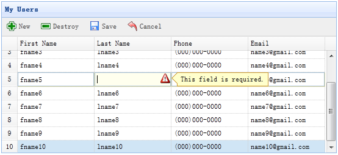

# jQuery EasyUI 应用 - 创建 CRUD 数据网格（DataGrid）

在上一章节中，我们使用对话框（dialog）组件创建了 CRUD 应用来创建和编辑用户信息。本教程我们将告诉您如何创建一个 CRUD 数据网格（DataGrid）。 我们将使用 [可编辑的数据网格（DataGrid）插件](ext-edatagrid.html) 来完成这些 CRUD 操作动作。



#### 步骤 1：在 HTML 标签中定义数据网格（DataGrid）

```
<table id="dg" title="My Users" style="width:550px;height:250px"
		toolbar="#toolbar" idField="id"
		rownumbers="true" fitColumns="true" singleSelect="true">
	<thead>
		<tr>
			<th field="firstname" width="50" editor="{type:'validatebox',options:{required:true}}">First Name</th>
			<th field="lastname" width="50" editor="{type:'validatebox',options:{required:true}}">Last Name</th>
			<th field="phone" width="50" editor="text">Phone</th>
			<th field="email" width="50" editor="{type:'validatebox',options:{validType:'email'}}">Email</th>
		</tr>
	</thead>
</table>
<div id="toolbar">
	<a href="#" class="easyui-linkbutton" iconCls="icon-add" plain="true" onclick="javascript:$('#dg').edatagrid('addRow')">New</a>
	<a href="#" class="easyui-linkbutton" iconCls="icon-remove" plain="true" onclick="javascript:$('#dg').edatagrid('destroyRow')">Destroy</a>
	<a href="#" class="easyui-linkbutton" iconCls="icon-save" plain="true" onclick="javascript:$('#dg').edatagrid('saveRow')">Save</a>
	<a href="#" class="easyui-linkbutton" iconCls="icon-undo" plain="true" onclick="javascript:$('#dg').edatagrid('cancelRow')">Cancel</a>
</div>

```

#### 步骤 2：使用可编辑的数据网格（DataGrid）

```
$('#dg').edatagrid({
	url: 'get_users.php',
	saveUrl: 'save_user.php',
	updateUrl: 'update_user.php',
	destroyUrl: 'destroy_user.php'
});

```

我们应该提供 'url'、'saveUrl'、'updateUrl' 和 'destroyUrl' 属性来编辑数据网格（DataGrid）：

*   url：从服务器端检索用户数据。
*   saveUrl：保存一个新的用户数据。
*   updateUrl：更新一个已存在的用户数据。
*   destroyUrl：删除一个已存在的用户数据。

#### 步骤 3：写服务器处理代码

保存一个新的用户（save_user.php）：

```
$firstname = $_REQUEST['firstname'];
$lastname = $_REQUEST['lastname'];
$phone = $_REQUEST['phone'];
$email = $_REQUEST['email'];

include 'conn.php';

$sql = "insert into users(firstname,lastname,phone,email) values('$firstname','$lastname','$phone','$email')";
@mysql_query($sql);
echo json_encode(array(
	'id' => mysql_insert_id(),
	'firstname' => $firstname,
	'lastname' => $lastname,
	'phone' => $phone,
	'email' => $email
));

```

更新一个已存在用户（update_user.php）：

```
$id = intval($_REQUEST['id']);
$firstname = $_REQUEST['firstname'];
$lastname = $_REQUEST['lastname'];
$phone = $_REQUEST['phone'];
$email = $_REQUEST['email'];

include 'conn.php';

$sql="update users set firstname='$firstname',lastname='$lastname',phone='$phone',email='$email' where id=$id";
@mysql_query($sql);
echo json_encode(array(
	'id' => $id,
	'firstname' => $firstname,
	'lastname' => $lastname,
	'phone' => $phone,
	'email' => $email
));

```

删除一个已存在用户（destroy_user.php）：

```
$id = intval($_REQUEST['id']);

include 'conn.php';

$sql = "delete from users where id=$id";
@mysql_query($sql);
echo json_encode(array('success'=>true));

```

## 下载 jQuery EasyUI 实例

[jeasyui-app-crud2.zip](/try/jeasyui/download/jeasyui-app-crud2.zip)

 