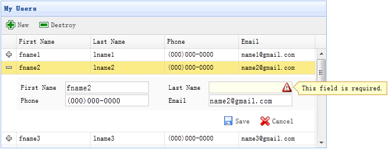

# jQuery EasyUI 应用 - 创建展开行明细编辑表单的 CRUD 应用

当切换数据网格视图（datagrid view）到 'detailview'，用户可以展开一行来显示一些行的明细在行下面。这个功能允许您为防止在明细行面板（panel）中的编辑表单（form）提供一些合适的布局（layout）。在本教程中，我们使用数据网格（datagrid）组件来减小编辑表单（form）所占据空间。



#### 步骤 1：在 HTML 标签中定义数据网格（DataGrid）

```
<table id="dg" title="My Users" style="width:550px;height:250px"
		url="get_users.php"
		toolbar="#toolbar"
		fitColumns="true" singleSelect="true">
	<thead>
		<tr>
			<th field="firstname" width="50">First Name</th>
			<th field="lastname" width="50">Last Name</th>
			<th field="phone" width="50">Phone</th>
			<th field="email" width="50">Email</th>
		</tr>
	</thead>
</table>
<div id="toolbar">
	<a href="#" class="easyui-linkbutton" iconCls="icon-add" plain="true" onclick="newItem()">New</a>
	<a href="#" class="easyui-linkbutton" iconCls="icon-remove" plain="true" onclick="destroyItem()">Destroy</a>
</div>

```

#### 步骤 2：为数据网格（DataGrid）应用明细视图

```
$('#dg').datagrid({
	view: detailview,
	detailFormatter:function(index,row){
		return '<div class="ddv"></div>';
	},
	onExpandRow: function(index,row){
		var ddv = $(this).datagrid('getRowDetail',index).find('div.ddv');
		ddv.panel({
			border:false,
			cache:true,
			href:'show_form.php?index='+index,
			onLoad:function(){
				$('#dg').datagrid('fixDetailRowHeight',index);
				$('#dg').datagrid('selectRow',index);
				$('#dg').datagrid('getRowDetail',index).find('form').form('load',row);
			}
		});
		$('#dg').datagrid('fixDetailRowHeight',index);
	}
});

```

为了为数据网格（DataGrid）应用明细视图，在 html 页面头部引入 'datagrid-detailview.js' 文件。

我们使用 'detailFormatter' 函数来生成行明细内容。 在这种情况下，我们返回一个用于放置编辑表单（form）的空的 &lt;div&gt;。 当用户点击行展开按钮（'+'）时，'onExpandRow' 事件将被触发，我们将通过 ajax 加载编辑表单（form）。 调用 'getRowDetail' 方法来得到行明细容器，所以我们能查找到行明细面板（panel）。 在行明细中创建面板（panel），加载从 'show_form.php' 返回的编辑表单（form）。

#### 步骤 3：创建编辑表单（Form）

编辑表单（form）是从服务器加载的。

show_form.php

```
<form method="post">
	<table class="dv-table" style="width:100%;background:#fafafa;padding:5px;margin-top:5px;">
		<tr>
			<td>First Name</td>
			<td><input name="firstname" class="easyui-validatebox" required="true"></input></td>
			<td>Last Name</td>
			<td><input name="lastname" class="easyui-validatebox" required="true"></input></td>
		</tr>
		<tr>
			<td>Phone</td>
			<td><input name="phone"></input></td>
			<td>Email</td>
			<td><input name="email" class="easyui-validatebox" validType="email"></input></td>
		</tr>
	</table>
	<div style="padding:5px 0;text-align:right;padding-right:30px">
		<a href="#" class="easyui-linkbutton" iconCls="icon-save" plain="true" onclick="saveItem(&lt;?php echo $_REQUEST['index'];?&gt;)">Save</a>
		<a href="#" class="easyui-linkbutton" iconCls="icon-cancel" plain="true" onclick="cancelItem(&lt;?php echo $_REQUEST['index'];?&gt;)">Cancel</a>
	</div>
</form>

```

#### 步骤 4：保存或取消编辑

调用 'saveItem' 函数来保存一个用户或者调用 'cancelItem' 函数来取消编辑。

```
function saveItem(index){
	var row = $('#dg').datagrid('getRows')[index];
	var url = row.isNewRecord ? 'save_user.php' : 'update_user.php?id='+row.id;
	$('#dg').datagrid('getRowDetail',index).find('form').form('submit',{
		url: url,
		onSubmit: function(){
			return $(this).form('validate');
		},
		success: function(data){
			data = eval('('+data+')');
			data.isNewRecord = false;
			$('#dg').datagrid('collapseRow',index);
			$('#dg').datagrid('updateRow',{
				index: index,
				row: data
			});
		}
	});
}

```

决定要回传哪一个 URL，然后查找表单（form）对象，并调用 'submit' 方法来提交表单（form）数据。当保存数据成功时，折叠并更新行数据。

```
function cancelItem(index){
	var row = $('#dg').datagrid('getRows')[index];
	if (row.isNewRecord){
		$('#dg').datagrid('deleteRow',index);
	} else {
		$('#dg').datagrid('collapseRow',index);
	}
}

```

当取消编辑动作时，如果该行是新行而且还没有保存，直接删除该行，否则折叠该行。

## 下载 jQuery EasyUI 实例

[jeasyui-app-crud3.zip](/try/jeasyui/download/jeasyui-app-crud3.zip)

 