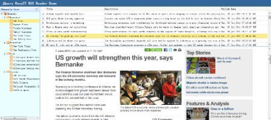

# jQuery EasyUI 应用 - 创建 RSS Feed 阅读器

在本教程中，我们将通过 jQuery EasyUI 框架创建一个 RSS 阅读器。



我们将使用以下插件:

*   layout：创建应用的用户界面。
*   datagrid：显示 RSS Feed 列表。
*   tree：显示 feed 频道。

#### 步骤 1：创建布局（Layout）

```
&lt;body class="easyui-layout"&gt;
	<div region="north" border="false" class="rtitle">
		jQuery EasyUI RSS Reader Demo
	</div>
	<div region="west" title="Channels Tree" split="true" border="false" style="width:200px;background:#EAFDFF;">
		<ul id="t-channels" url="data/channels.json"></ul>
	</div>
	<div region="center" border="false">
		<div class="easyui-layout" fit="true">
			<div region="north" split="true" border="false" style="height:200px">
				<table id="dg" 
						url="get_feed.php" border="false" rownumbers="true"
						fit="true" fitColumns="true" singleSelect="true">
					<thead>
						<tr>
							<th field="title" width="100">Title</th>
							<th field="description" width="200">Description</th>
							<th field="pubdate" width="80">Publish Date</th>
						</tr>
					</thead>
				</table>
			</div>
			<div region="center" border="false" style="overflow:hidden">
				<iframe id="cc" scrolling="auto" frameborder="0" style="width:100%;height:100%"></iframe>
			</div>
		</div>
	</div>
&lt;/body&gt;

```

#### 步骤 2：数据网格（DataGrid）处理事件

在这里我们要处理一些由用户触发的事件。

```
$('#dg').datagrid({
	onSelect: function(index,row){
		$('#cc').attr('src', row.link);
	},
	onLoadSuccess:function(){
		var rows = $(this).datagrid('getRows');
		if (rows.length){
			$(this).datagrid('selectRow',0);
		}
	}
});

```

本实例使用 'onSelect' 事件来显示 feed 的内容，使用 'onLoadSuccess' 事件来选择第一行。

#### 步骤 3：树形菜单（Tree）处理事件

当树形菜单（Tree）数据已经加载，我们需要选择第一个叶子节点，调用 'select' 方法来选择该节点。 使用 'onSelect' 事件来得到已选择的节点，这样我们就能得到对应的 'url' 值。 最后我们调用数据网格（DataGrid） 的 'load' 方法来刷新 feed 列表数据。

```
$('#t-channels').tree({
	onSelect: function(node){
		var url = node.attributes.url;
		$('#dg').datagrid('load',{
			url: url
		});
	},
	onLoadSuccess:function(node,data){
		if (data.length){
			var id = data[0].children[0].children[0].id;
			var n = $(this).tree('find', id);
			$(this).tree('select', n.target);
		}
	}
});

```

## 下载 jQuery EasyUI 实例

[jeasyui-app-rssreader.zip](/try/jeasyui/download/jeasyui-app-rssreader.zip)

 