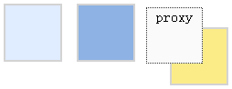

# jQuery EasyUI 拖放 - 基本的拖动和放置

本教程向您展示如何使 HTML 元素可拖动，在本例中，我们将创建三个 DIV 元素然后启用他们的拖动和放置。



首先，我们创建三个 &lt;div&gt; 元素：

```
	<div id="dd1" class="dd-demo"></div>
	<div id="dd2" class="dd-demo"></div>
	<div id="dd3" class="dd-demo"></div>

```

对于第一个 &lt;div&gt; 元素，我们通过默认值让其可以拖动。

```
	$('#dd1').draggable();

```

对于第二个 &lt;div&gt; 元素，我们通过创建一个克隆（clone）了原来元素的代理（proxy）让其可以拖动。

```
	$('#dd2').draggable({
		proxy:'clone'
	});

```

对于第三个 &lt;div&gt; 元素，我们通过创建自定义代理（proxy）让其可以拖动。

```
	$('#dd3').draggable({
		proxy:function(source){
			var p = $('<div class="proxy">proxy</div>');
			p.appendTo('body');
			return p;
		}
	});

```

## 下载 jQuery EasyUI 实例

[jeasyui-dd-basic.zip](/try/jeasyui/download/jeasyui-dd-basic.zip)

 