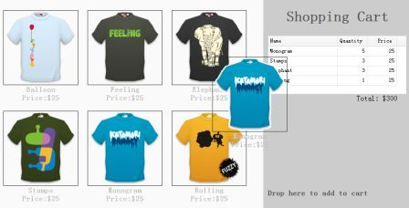

# jQuery EasyUI 拖放 - 创建拖放的购物车

如果您能够通过您的 Web 应用简单地实现拖动和放置，您就会知道一些特别的东西。通过 jQuery EasyUI，我们在 Web 应用中可以简单地实现拖放功能。

在本教程中，我们将向您展示如何创建一个启用用户拖动和放置用户想买的商品的购物车页面。购物篮中的物品和价格将更新。



#### 显示页面上的商品

```
	<ul class="products">
		<li>
			<a href="#" class="item">
				
				<div>
					<p>Balloon</p>
					<p>Price:$25</p>
				</div>
			</a>
		</li>
		<li>
			<a href="#" class="item">
				
				<div>
					<p>Feeling</p>
					<p>Price:$25</p>
				</div>
			</a>
		</li>
		<!-- other products -->
	</ul>

```

正如您所看到的上面的代码，我们添加一个包含一些 &lt;li&gt; 元素的 &lt;ul&gt; 元素来显示商品。所有商品都有名字和价格属性，它们包含在 &lt;p&gt; 元素中。

#### 创建购物车

```
	<div class="cart">
		<h1>Shopping Cart</h1>
		<table id="cartcontent" style="width:300px;height:auto;">
			<thead>
				<tr>
					<th field="name" width=140>Name</th>
					<th field="quantity" width=60 align="right">Quantity</th>
					<th field="price" width=60 align="right">Price</th>
				</tr>
			</thead>
		</table>
		<p class="total">Total: $0</p>
		<h2>Drop here to add to cart</h2>
	</div>

```

我们使用数据网格（datagrid）来显示购物篮中的物品。

#### 拖动克隆的商品

```
	$('.item').draggable({
		revert:true,
		proxy:'clone',
		onStartDrag:function(){
			$(this).draggable('options').cursor = 'not-allowed';
			$(this).draggable('proxy').css('z-index',10);
		},
		onStopDrag:function(){
			$(this).draggable('options').cursor='move';
		}
	});

```

请注意，我们把 draggable 属性的值从 'proxy' 设置为 'clone'，所以拖动元素将由克隆产生。

#### 放置选择商品到购物车中

```
	$('.cart').droppable({
		onDragEnter:function(e,source){
			$(source).draggable('options').cursor='auto';
		},
		onDragLeave:function(e,source){
			$(source).draggable('options').cursor='not-allowed';
		},
		onDrop:function(e,source){
			var name = $(source).find('p:eq(0)').html();
			var price = $(source).find('p:eq(1)').html();
			addProduct(name, parseFloat(price.split('$')[1]));
		}
	});
	var data = {"total":0,"rows":[]};
	var totalCost = 0;
	function addProduct(name,price){
		function add(){
			for(var i=0; i<data.total; i++){
				var row = data.rows[i];
				if (row.name == name){
					row.quantity += 1;
					return;
				}
			}
			data.total += 1;
			data.rows.push({
				name:name,
				quantity:1,
				price:price
			});
		}
		add();
		totalCost += price;
		$('#cartcontent').datagrid('loadData', data);
		$('div.cart .total').html('Total: $'+totalCost);
	}	

```

每当放置商品的时候，我们首先得到商品名称和价格，然后调用 'addProduct' 函数来更新购物篮。

## 下载 jQuery EasyUI 实例

[jeasyui-dd-shopping.zip](/try/jeasyui/download/jeasyui-dd-shopping.zip)

 