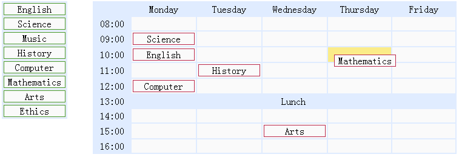

# jQuery EasyUI 拖放 - 创建学校课程表

本教程将向您展示如何使用 jQuery EasyUI 创建一个学校课程表。 我们将创建两个表格：在左侧显示学校科目，在右侧显示时间表。 您可以拖动学校科目并放置到时间表单元格上。 学校科目是一个 &lt;div class="item"&gt; 元素，时间表单元格是一个 &lt;td class="drop"&gt; 元素。



#### 显示学校科目

```
	<div class="left">
		<table>
			<tr>
				<td><div class="item">English</div></td>
			</tr>
			<tr>
				<td><div class="item">Science</div></td>
			</tr>
			<!-- other subjects -->
		</table>
	</div>

```

#### 显示时间表

```
	<div class="right">
		<table>
			<tr>
				<td class="blank"></td>
				<td class="title">Monday</td>
				<td class="title">Tuesday</td>
				<td class="title">Wednesday</td>
				<td class="title">Thursday</td>
				<td class="title">Friday</td>
			</tr>
			<tr>
				<td class="time">08:00</td>
				<td class="drop"></td>
				<td class="drop"></td>
				<td class="drop"></td>
				<td class="drop"></td>
				<td class="drop"></td>
			</tr>
			<!-- other cells -->
		</table>
	</div>

```

#### 拖动在左侧的学校科目

```
	$('.left .item').draggable({
		revert:true,
		proxy:'clone'
	});

```

#### 放置学校科目在时间表单元格上

```
	$('.right td.drop').droppable({
		onDragEnter:function(){
			$(this).addClass('over');
		},
		onDragLeave:function(){
			$(this).removeClass('over');
		},
		onDrop:function(e,source){
			$(this).removeClass('over');
			if ($(source).hasClass('assigned')){
				$(this).append(source);
			} else {
				var c = $(source).clone().addClass('assigned');
				$(this).empty().append(c);
				c.draggable({
					revert:true
				});
			}
		}
	});

```

正如您所看到的上面的代码，当用户拖动在左侧的学校科目并放置到时间表单元格中时，onDrop 回调函数将被调用。我们克隆从左侧拖动的源元素并把它附加到时间表单元格上。 当把学校科目从时间表的某个单元格拖动到其他单元格，只需简单地移动它即可。

## 下载 jQuery EasyUI 实例

[jeasyui-dd-timetable.zip](/try/jeasyui/download/jeasyui-dd-timetable.zip)

 