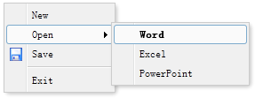

# jQuery EasyUI 菜单与按钮 - 创建简单的菜单



菜单（Menu）定义在一些 DIV 标记中，如下所示：

```
	<div id="mm" class="easyui-menu" style="width:120px;">
		<div onclick="javascript:alert('new')">New</div>
		<div>
			<span>Open</span>
			<div style="width:150px;">
				<div><b>Word</b></div>
				<div>Excel</div>
				<div>PowerPoint</div>
			</div>
		</div>
		<div icon="icon-save">Save</div>
		<div class="menu-sep"></div>
		<div>Exit</div>
	</div>

```

当菜单创建之后是不显示的，调用 'show' 方法显示它或者调用 'hide' 方法隐藏它：

```
	$('#mm').menu('show', {
	  left: 200,
	  top: 100
	});

```

## 下载 jQuery EasyUI 实例

[jeasyui-mb-menu.zip](/try/jeasyui/download/jeasyui-mb-menu.zip)

 