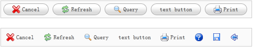

# jQuery EasyUI 菜单与按钮 - 创建链接按钮（Link Button）

通常情况下，使用 &lt;button&gt; 元素来创建按钮，而链接按钮（Link Button）则是使用 &lt;a&gt; 元素来创建的。所以实际上一个链接按钮（Link Button）就是一个显示为按钮样式的 &lt;a&gt; 元素。



为了创建链接按钮（Link Button），所有您需要做的就是添加一个名为 'easyui-linkbutton' 的 class 属性到 &lt;a&gt; 元素：

```
	<div style="padding:5px;background:#fafafa;width:500px;border:1px solid #ccc">
		<a href="#" class="easyui-linkbutton" iconCls="icon-cancel">Cancel</a>
		<a href="#" class="easyui-linkbutton" iconCls="icon-reload">Refresh</a>
		<a href="#" class="easyui-linkbutton" iconCls="icon-search">Query</a>
		<a href="#" class="easyui-linkbutton">text button</a>
		<a href="#" class="easyui-linkbutton" iconCls="icon-print">Print</a>
	</div>

	<div style="padding:5px;background:#fafafa;width:500px;border:1px solid #ccc">
		<a href="#" class="easyui-linkbutton" plain="true" iconCls="icon-cancel">Cancel</a>
		<a href="#" class="easyui-linkbutton" plain="true" iconCls="icon-reload">Refresh</a>
		<a href="#" class="easyui-linkbutton" plain="true" iconCls="icon-search">Query</a>
		<a href="#" class="easyui-linkbutton" plain="true">text button</a>
		<a href="#" class="easyui-linkbutton" plain="true" iconCls="icon-print">Print</a>
		<a href="#" class="easyui-linkbutton" plain="true" iconCls="icon-help"></a>
		<a href="#" class="easyui-linkbutton" plain="true" iconCls="icon-save"></a>
		<a href="#" class="easyui-linkbutton" plain="true" iconCls="icon-back"></a>
	</div>

```

正如您所看到的，iconCls 属性是一个 icon 的 CSS class 样式，它在按钮上显示一个 icon 图片。

有时候您需要禁用链接按钮（Link Button）或者启用它，下面的代码演示了如何禁用一个链接按钮（Link Button）：

```
	$(selector).linkbutton('disable');	// call the 'disable' method

```

 