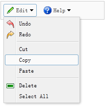

# jQuery EasyUI 菜单与按钮 - 创建菜单按钮（Menu Button）

菜单按钮（Menu Button）包含一个按钮（button）和一个菜单（menu）组件，当点击或移动鼠标到按钮上，将显示一个对应的菜单。



为了定义一个菜单按钮（Menu Button），您应该定义一个链接按钮（Link Button）和一个菜单（menu），下面是一个实例：

```
	<div style="background:#fafafa;padding:5px;width:200px;border:1px solid #ccc">
		<a href="#" class="easyui-menubutton" menu="#mm1" iconCls="icon-edit">Edit</a>
		<a href="#" class="easyui-menubutton" menu="#mm2" iconCls="icon-help">Help</a>
	</div>
	<div id="mm1" style="width:150px;">
		<div iconCls="icon-undo">Undo</div>
		<div iconCls="icon-redo">Redo</div>
		<div class="menu-sep"></div>
		<div>Cut</div>
		<div>Copy</div>
		<div>Paste</div>
		<div class="menu-sep"></div>
		<div iconCls="icon-remove">Delete</div>
		<div>Select All</div>
	</div>
	<div id="mm2" style="width:100px;">
		<div>Help</div>
		<div>Update</div>
		<div>About</div>
	</div>

```

现在已经定义好了一个菜单按钮（Menu Button），您不需要写任何的 javascript 代码。

 