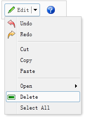

# jQuery EasyUI 菜单与按钮 - 创建分割按钮（Split Button）

分割按钮（Split Button）包含一个链接按钮（Link Button）和一个菜单（Menu）。当用户点击或者鼠标悬停在向下箭头区域，将会显示一个对应的菜单。本实例演示了如何创建和使用分割按钮（Split Button）。



我们创建一个分割按钮（Split Button）和一个链接按钮（Link Button）：

```
	<div style="border:1px solid #ccc;background:#fafafa;padding:5px;width:120px;">
		<a href="#" class="easyui-splitbutton" menu="#mm" iconCls="icon-edit">Edit</a>
		<a href="#" class="easyui-linkbutton" plain="true" iconCls="icon-help"></a>
	</div>
	<div id="mm" style="width:150px;">
		<div iconCls="icon-undo">Undo</div>
		<div iconCls="icon-redo">Redo</div>
		<div class="menu-sep"></div>
		<div>Cut</div>
		<div>Copy</div>
		<div>Paste</div>
		<div class="menu-sep"></div>
		<div>
			<span>Open</span>
			<div style="width:150px;">
				<div>Firefox</div>
				<div>Internet Explorer</div>
				<div class="menu-sep"></div>
				<div>Select Program...</div>
			</div>
		</div>
		<div iconCls="icon-remove">Delete</div>
		<div>Select All</div>
	</div>

```

现在已经定义好了一个分割按钮（Split Button），您不需要写任何的 javascript 代码。

 