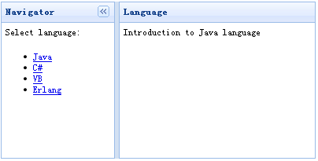

# jQuery EasyUI 布局 - 为网页创建边框布局

边框布局（border layout）提供五个区域：east、west、north、south、center。以下是一些通常用法：

*   north 区域可以用来显示网站的标语。
*   south 区域可以用来显示版权以及一些说明。
*   west 区域可以用来显示导航菜单。
*   east 区域可以用来显示一些推广的项目。
*   center 区域可以用来显示主要的内容。



为了应用布局（layout），您应该确定一个布局（layout）容器，然后定义一些区域。布局（layout）必须至少需要一个 center 区域，以下是一个布局（layout）实例：

```
	<div class="easyui-layout" style="width:400px;height:200px;">
		<div region="west" split="true" title="Navigator" style="width:150px;">
			<p style="padding:5px;margin:0;">Select language:</p>
			<ul>
				<li><a href="javascript:void(0)" onclick="showcontent('java')">Java</a></li>
				<li><a href="javascript:void(0)" onclick="showcontent('cshape')">C#</a></li>
				<li><a href="javascript:void(0)" onclick="showcontent('vb')">VB</a></li>
				<li><a href="javascript:void(0)" onclick="showcontent('erlang')">Erlang</a></li>
			</ul>
		</div>
		<div id="content" region="center" title="Language" style="padding:5px;">
		</div>
	</div>

```

我们在一个 &lt;div&gt; 容器中创建了一个边框布局（border layout），布局（layout）把容器切割为两个部分，左边是导航菜单，右边是主要内容。

最后我们写一个 onclick 事件处理函数来检索数据，'showcontent' 函数非常简单：

```
	function showcontent(language){
		$('#content').html('Introduction to ' + language + ' language');
	}

```

## 下载 jQuery EasyUI 实例

[jeasyui-layout-layout.zip](/try/jeasyui/download/jeasyui-layout-layout.zip)

 