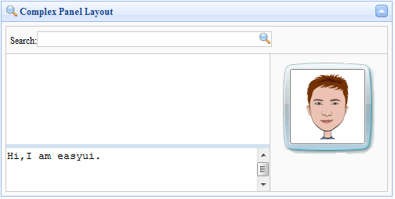

# jQuery EasyUI 布局 - 在面板中创建复杂布局

面板（Panel）允许您创建用于多种用途的自定义布局。在本实例中，我们使用面板（panel）和布局（layout）插件来创建一个 msn 消息框。



我们在区域面板中使用多个布局（layout）。在消息框的顶部我们放置一个查询输入框，同时在右边放置一个人物图片。在中间的区域我们通过设置 split 属性为 true，把这部分切割为两部分，允许用户改变区域面板的尺寸大小。

以下就是所有代码：

```
	<div class="easyui-panel" title="Complex Panel Layout" iconCls="icon-search" collapsible="true" style="padding:5px;width:500px;height:250px;">
		<div class="easyui-layout" fit="true">
			<div region="north" border="false" class="p-search">
				<label>Search:</label><input></input>
			</div>
			<div region="center" border="false">
				<div class="easyui-layout" fit="true">
					<div region="east" border="false" class="p-right">
						
					</div>
					<div region="center" border="false" style="border:1px solid #ccc;">
						<div class="easyui-layout" fit="true">
							<div region="south" split="true" border="false" style="height:60px;">
								<textarea style="border:0;width:100%;height:100%;resize:none">Hi,I am easyui.</textarea>
							</div>
							<div region="center" border="false">
							</div>
						</div>
					</div>
				</div>
			</div>
		</div>
	</div>

```

我们不需要写任何的 javascript 代码，它自己有非常强大的设计用户界面的功能。

## 下载 jQuery EasyUI 实例

[jeasyui-layout-panel.zip](/try/jeasyui/download/jeasyui-layout-panel.zip)

 