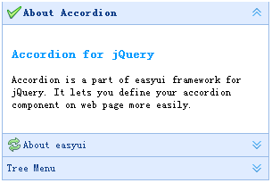

# jQuery EasyUI 布局 - 创建折叠面板

在本教程中，您将会学习到关于 easyui 折叠面板（Accordion）的知识。 折叠面板（Accordion）包含一系列的面板（panel）。 所有面板（panel）的头部（header）都是可见的，但是一次仅仅显示一个面板（panel）的 body 内容。 当用户点击面板（panel）的头部（header）时，该面板（panel）的 body 内容将可见，同时其他面板（panel）的 body 内容将隐藏不可见。



我们将创建三个面板（panel），第三个面板（panel）包含一个树形菜单。

```
	<div class="easyui-accordion" style="width:300px;height:200px;">
		<div title="About Accordion" iconCls="icon-ok" style="overflow:auto;padding:10px;">
			<h3 style="color:#0099FF;">Accordion for jQuery</h3>
			<p>Accordion is a part of easyui framework for jQuery. It lets you define your accordion component on web page more easily.</p>
		</div>
		<div title="About easyui" iconCls="icon-reload" selected="true" style="padding:10px;">
			easyui help you build your web page easily
		</div>
		<div title="Tree Menu">
			<ul id="tt1" class="easyui-tree">
				<li>
					<span>Folder1</span>
					<ul>
						<li>
							<span>Sub Folder 1</span>
							<ul>
								<li><span>File 11</span></li>
								<li><span>File 12</span></li>
								<li><span>File 13</span></li>
							</ul>
						</li>
						<li><span>File 2</span></li>
						<li><span>File 3</span></li>
					</ul>
				</li>
				<li><span>File2</span></li>
			</ul>
		</div>
	</div>

```

## 下载 jQuery EasyUI 实例

[jeasyui-layout-accordion.zip](/try/jeasyui/download/jeasyui-layout-accordion.zip)

 