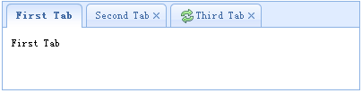

# jQuery EasyUI 布局 - 创建标签页（Tabs）

本教程将向您延时如何使用 easyui 创建一个 Tabs 组件。 Tabs 有多个可以动态地添加或移除的面板（panel）。 您可以使用 Tabs 来在相同的页面上显示不同的实体。

Tabs 一次仅仅显示一个面板（panel），每个面板（panel）都有标题、图标和关闭按钮。 当 Tabs 被选中时，将显示对应的面板（panel）的内容。



从 HTML 标记创建 Tabs，包含一个 DIV 容器和一些 DIV 面板（panel）。

```
	<div class="easyui-tabs" style="width:400px;height:100px;">
		<div title="First Tab" style="padding:10px;">
			First Tab
		</div>
		<div title="Second Tab" closable="true" style="padding:10px;">
			Second Tab
		</div>
		<div title="Third Tab" iconCls="icon-reload" closable="true" style="padding:10px;">
			Third Tab
		</div>
	</div>

```

我们创建一个带有三个面板（panel）的 Tabs 组件，第二个和第三个面板（panel）可以通过点击关闭按钮进行关闭。

## 下载 jQuery EasyUI 实例

[jeasyui-layout-tabs1.zip](/try/jeasyui/download/jeasyui-layout-tabs1.zip)

 