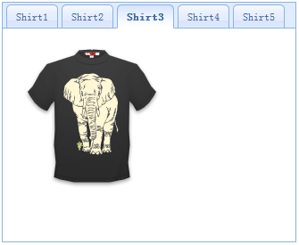

# jQuery EasyUI 布局 - 添加自动播放标签页（Tabs）

本教程将向您展示如何创建一个自动播放的 Tabs。 Tabs 组件显示第一个 tab 面板，然后显示第二个、第三个... 我们将写一些代码来自动地切换 tab 面板，然后让它循环。



#### 步骤 1：创建 Tabs

```
	<div id="tt" class="easyui-tabs" style="width:330px;height:270px;">
		<div title="Shirt1" style="padding:20px;">
			
		</div>
		<div title="Shirt2" style="padding:20px;">
			
		</div>
		<div title="Shirt3" style="padding:20px;">
			
		</div>
		<div title="Shirt4" style="padding:20px;">
			
		</div>
		<div title="Shirt5" style="padding:20px;">
			
		</div>
	</div>

```

#### 步骤 2：写自动播放代码

```
	var index = 0;
	var t = $('#tt');
	var tabs = t.tabs('tabs');
	setInterval(function(){
		t.tabs('select', tabs[index].panel('options').title);
		index++;
		if (index >= tabs.length){
			index = 0;
		}
	}, 3000);

```

正如您所看到的，我们调用 'tabs' 方法来得到所有 tab 面板，并使用 'setInterval' 函数来切换他们。

## 下载 jQuery EasyUI 实例

[jeasyui-layout-tabs3.zip](/try/jeasyui/download/jeasyui-layout-tabs3.zip)

 