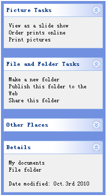

# jQuery EasyUI 布局 - 创建 XP 风格左侧面板

通常情况下，在 Windows XP 的资源管理器文件夹中，左侧的面板（panel）包含一些常见任务。 本教程向您展示如何通过 easyui 的面板（panel）插件来创建 XP 左侧面板。



#### 定义一些面板（panel）

我们定义一些面板（panel），这些面板（panel）用来显示一些任务。每个面板（panel）应该至少有折叠/展开工具按钮。

代码如下所示：

```
	<div style="width:200px;height:auto;background:#7190E0;padding:5px;">
		<div class="easyui-panel" title="Picture Tasks" collapsible="true" style="width:200px;height:auto;padding:10px;">
			View as a slide show<br/>
			Order prints online<br/>
			Print pictures
		</div>
		<br/>
		<div class="easyui-panel" title="File and Folder Tasks" collapsible="true" style="width:200px;height:auto;padding:10px;">
			Make a new folder<br/>
			Publish this folder to the Web<br/>
			Share this folder
		</div>
		<br/>
		<div class="easyui-panel" title="Other Places" collapsible="true" collapsed="true" style="width:200px;height:auto;padding:10px;">
			New York<br/>
			My Pictures<br/>
			My Computer<br/>
			My Network Places
		</div>
		<br/>
		<div class="easyui-panel" title="Details" collapsible="true" style="width:200px;height:auto;padding:10px;">
			My documents<br/>
			File folder<br/><br/>
			Date modified: Oct.3rd 2010
		</div>
	</div>

```

#### 自定义面板（panel）的外观效果

请注意，这个视图外观效果不是我们想要的，我们必须改变面板（panel）的头部背景图片和折叠/展开按钮的图标。

做到这一点并不难，我们需要做的只是重新定义一些 CSS。

```
	.panel-body{
		background:#f0f0f0;
	}
	.panel-header{
		background:#fff url('images/panel_header_bg.gif') no-repeat top right;
	}
	.panel-tool-collapse{
		background:url('images/arrow_up.gif') no-repeat 0px -3px;
	}
	.panel-tool-expand{
		background:url('images/arrow_down.gif') no-repeat 0px -3px;
	}

```

由此可见，使用 easyui 定义用户界面非常简单。

## 下载 jQuery EasyUI 实例

[jeasyui-layout-xp.zip](/try/jeasyui/download/jeasyui-layout-xp.zip)

 