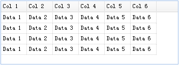
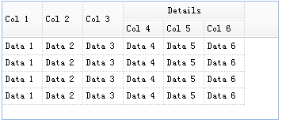

# jQuery EasyUI 数据网格 - 转换 HTML 表格为数据网格

本实例演示如何转换表格（table）为数据网格（datagrid）。



数据网格（datagrid）的列信息是定义在 &lt;thead&gt; 标记中，数据是定义在 &lt;tbody&gt; 标记中。确保为所有的数据列设置 field 名称，请看下面的实例：

```
	<table id="tt" class="easyui-datagrid" style="width:400px;height:auto;">
		<thead>
			<tr>
				<th field="name1" width="50">Col 1</th>
				<th field="name2" width="50">Col 2</th>
				<th field="name3" width="50">Col 3</th>
				<th field="name4" width="50">Col 4</th>
				<th field="name5" width="50">Col 5</th>
				<th field="name6" width="50">Col 6</th>
			</tr>                          
		</thead>                           
		<tbody>                            
			<tr>                           
				<td>Data 1</td>            
				<td>Data 2</td>            
				<td>Data 3</td>            
				<td>Data 4</td>            
				<td>Data 5</td>            
				<td>Data 6</td>            
			</tr>                          
			<tr>                           
				<td>Data 1</td>            
				<td>Data 2</td>            
				<td>Data 3</td>            
				<td>Data 4</td>            
				<td>Data 5</td>            
				<td>Data 6</td>            
			</tr>                          
			<tr>                           
				<td>Data 1</td>            
				<td>Data 2</td>            
				<td>Data 3</td>            
				<td>Data 4</td>            
				<td>Data 5</td>            
				<td>Data 6</td>            
			</tr>                          
			<tr>                           
				<td>Data 1</td>            
				<td>Data 2</td>            
				<td>Data 3</td>            
				<td>Data 4</td>            
				<td>Data 5</td>            
				<td>Data 6</td>            
			</tr>                          
		</tbody>                           
	</table>

```

非常棒，您可以定义一个复杂的表头，例如：

```
	<thead>
		<tr>
			<th field="name1" width="50" rowspan="2">Col 1</th>
			<th field="name2" width="50" rowspan="2">Col 2</th>
			<th field="name3" width="50" rowspan="2">Col 3</th>
			<th colspan="3">Details</th>
		</tr>
		<tr>
			<th field="name4" width="50">Col 4</th>
			<th field="name5" width="50">Col 5</th>
			<th field="name6" width="50">Col 6</th>
		</tr>                          
	</thead>

```

现在您可以看见，复杂表头已经创建。



## 下载 jQuery EasyUI 实例

[jeasyui-datagrid-datagrid1.zip](/try/jeasyui/download/jeasyui-datagrid-datagrid1.zip)

 