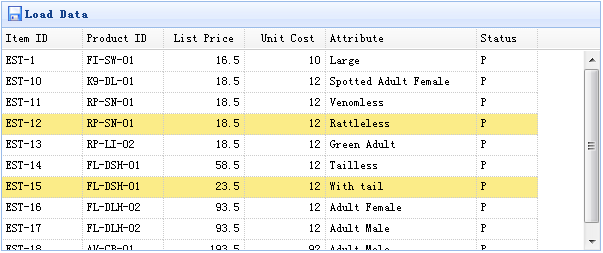

# jQuery EasyUI 数据网格 - 取得选中行数据

本实例演示如何取得选中行数据。



数据网格（datagrid）组件包含两种方法来检索选中行数据：

*   getSelected：取得第一个选中行数据，如果没有选中行，则返回 null，否则返回记录。
*   getSelections：取得所有选中行数据，返回元素记录的数组数据。

#### 创建数据网格（DataGrid）

```
	<table id="tt" class="easyui-datagrid" style="width:600px;height:250px"
			url="data/datagrid_data.json"
			title="Load Data" iconCls="icon-save">
		<thead>
			<tr>
				<th field="itemid" width="80">Item ID</th>
				<th field="productid" width="80">Product ID</th>
				<th field="listprice" width="80" align="right">List Price</th>
				<th field="unitcost" width="80" align="right">Unit Cost</th>
				<th field="attr1" width="150">Attribute</th>
				<th field="status" width="60" align="center">Stauts</th>
			</tr>
		</thead>
	</table>

```

#### 使用演示

取得选中行数据：

```
	var row = $('#tt').datagrid('getSelected');
	if (row){
		alert('Item ID:'+row.itemid+"\nPrice:"+row.listprice);
	}

```

取得所有选中行的 itemid：

```
	var ids = [];
	var rows = $('#tt').datagrid('getSelections');
	for(var i=0; i<rows.length; i++){
		ids.push(rows[i].itemid);
	}
	alert(ids.join('\n'));

```

## 下载 jQuery EasyUI 实例

[jeasyui-datagrid-datagrid3.zip](/try/jeasyui/download/jeasyui-datagrid-datagrid3.zip)

 