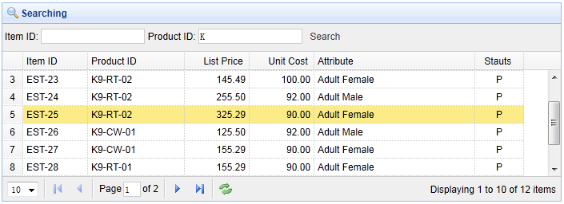

# jQuery EasyUI 数据网格 - 添加查询功能

本实例演示如何从数据库得到数据，并将它们显示在数据网格（datagrid）中。然后演示如何根据用户输入的搜索关键词搜寻显示结果。



#### 创建数据网格（DataGrid）

创建带有分页功能的数据网格（datagrid），然后添加工具栏到其中。

```
	<table id="tt" class="easyui-datagrid" style="width:600px;height:250px"
			url="datagrid24_getdata.php" toolbar="#tb"
			title="Load Data" iconCls="icon-save"
			rownumbers="true" pagination="true">
		<thead>
			<tr>
				<th field="itemid" width="80">Item ID</th>
				<th field="productid" width="80">Product ID</th>
				<th field="listprice" width="80" align="right">List Price</th>
				<th field="unitcost" width="80" align="right">Unit Cost</th>
				<th field="attr1" width="150">Attribute</th>
				<th field="status" width="60" align="center">Stauts</th>
			</tr>
		</thead>
	</table>

```

工具栏定义如下：

```
	<div id="tb" style="padding:3px">
		<span>Item ID:</span>
		<input id="itemid" style="line-height:26px;border:1px solid #ccc">
		<span>Product ID:</span>
		<input id="productid" style="line-height:26px;border:1px solid #ccc">
		<a href="#" class="easyui-linkbutton" plain="true" onclick="doSearch()">Search</a>
	</div>

```

当用户输入查询值并按下查询按钮时，'doSearch' 函数将被调用：

```
	function doSearch(){
		$('#tt').datagrid('load',{
			itemid: $('#itemid').val(),
			productid: $('#productid').val()
		});
	}

```

上面的代码调用了 'load' 方法来加载新的数据网格（datagrid）数据。我们需要传递 'itemid' 和 'productid' 参数到服务器。

#### 服务器端代码

```
	include 'conn.php';

	$page = isset($_POST['page']) ? intval($_POST['page']) : 1;
	$rows = isset($_POST['rows']) ? intval($_POST['rows']) : 10;
	$itemid = isset($_POST['itemid']) ? mysql_real_escape_string($_POST['itemid']) : '';
	$productid = isset($_POST['productid']) ? mysql_real_escape_string($_POST['productid']) : '';

	$offset = ($page-1)*$rows;

	$result = array();

	$where = "itemid like '$itemid%' and productid like '$productid%'";
	$rs = mysql_query("select count(*) from item where " . $where);
	$row = mysql_fetch_row($rs);
	$result["total"] = $row[0];

	$rs = mysql_query("select * from item where " . $where . " limit $offset,$rows");

	$items = array();
	while($row = mysql_fetch_object($rs)){
		array_push($items, $row);
	}
	$result["rows"] = $items;

	echo json_encode($result);

```

## 下载 jQuery EasyUI 实例

[jeasyui-datagrid-datagrid24.zip](/try/jeasyui/download/jeasyui-datagrid-datagrid24.zip)

 