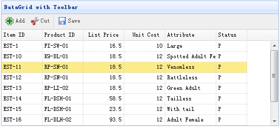

# jQuery EasyUI 数据网格 - 添加工具栏

本实例演示如何添加工具栏（toolbar）到数据网格（datagrid）。



#### 创建数据网格（DataGrid）

```
	<table id="tt" class="easyui-datagrid" style="width:600px;height:250px"
			url="data/datagrid_data.json"
			title="DataGrid with Toolbar" iconCls="icon-save"
			toolbar="#tb">
		<thead>
			<tr>
				<th field="itemid" width="80">Item ID</th>
				<th field="productid" width="80">Product ID</th>
				<th field="listprice" width="80" align="right">List Price</th>
				<th field="unitcost" width="80" align="right">Unit Cost</th>
				<th field="attr1" width="150">Attribute</th>
				<th field="status" width="60" align="center">Stauts</th>
			</tr>
		</thead>
	</table>
	<div id="tb">
		<a href="#" class="easyui-linkbutton" iconCls="icon-add" plain="true" onclick="javascript:alert('Add')">Add</a>
		<a href="#" class="easyui-linkbutton" iconCls="icon-cut" plain="true" onclick="javascript:alert('Cut')">Cut</a>
		<a href="#" class="easyui-linkbutton" iconCls="icon-save" plain="true" onclick="javascript:alert('Save')">Save</a>
	</div>

```

我们不需要写任何的 javascript 代码，只需通过 'toolbar' 属性附加工具栏（toolbar）到数据网格（datagrid）。

## 下载 jQuery EasyUI 实例

[jeasyui-datagrid-datagrid4.zip](/try/jeasyui/download/jeasyui-datagrid-datagrid4.zip)

 