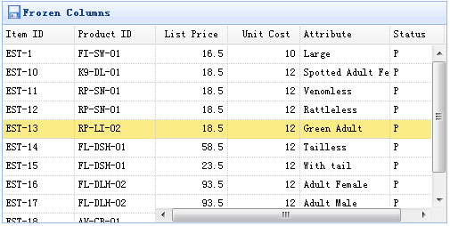

# jQuery EasyUI 数据网格 - 设置冻结列

本实例演示如何冻结一些列，当用户在网格上移动水平滚动条时，冻结列不能滚动到视图的外部。



为了冻结列，您需要定义 frozenColumns 属性。frozenColumn 属性和 columns 属性一样。

```
	$('#tt').datagrid({
		title:'Frozen Columns',
		iconCls:'icon-save',
		width:500,
		height:250,
		url:'data/datagrid_data.json',
		frozenColumns:[[
			{field:'itemid',title:'Item ID',width:80},
			{field:'productid',title:'Product ID',width:80},
		]],
		columns:[[
			{field:'listprice',title:'List Price',width:80,align:'right'},
			{field:'unitcost',title:'Unit Cost',width:80,align:'right'},
			{field:'attr1',title:'Attribute',width:100},
			{field:'status',title:'Status',width:60}
		]]
	});

```

您不需要写任何的 javascript 代码，这样您就能创建一个数据网格（datagrid）组件，如下所示：

```
	<table id="tt" title="Frozen Columns" class="easyui-datagrid" style="width:500px;height:250px"
			url="data/datagrid_data.json"
			singleSelect="true" iconCls="icon-save">
		<thead frozen="true">
			<tr>
				<th field="itemid" width="80">Item ID</th>
				<th field="productid" width="80">Product ID</th>
			</tr>
		</thead>
		<thead>
			<tr>
				<th field="listprice" width="80" align="right">List Price</th>
				<th field="unitcost" width="80" align="right">Unit Cost</th>
				<th field="attr1" width="150">Attribute</th>
				<th field="status" width="60" align="center">Stauts</th>
			</tr>
		</thead>
	</table>

```

## 下载 jQuery EasyUI 实例

[jeasyui-datagrid-datagrid5.zip](/try/jeasyui/download/jeasyui-datagrid-datagrid5.zip)

 