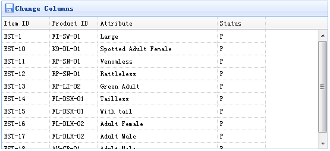
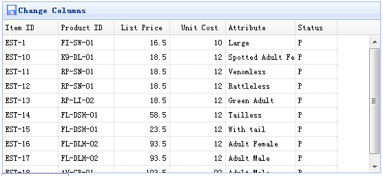

# jQuery EasyUI 数据网格 - 动态改变列

数据网格（DataGrid）列可以使用 'columns' 属性简单地定义。如果您想动态地改变列，那根本没有问题。为了改变列，您可以重新调用datagrid 方法，并传递一个新的 columns 属性。

#### 创建数据网格（DataGrid）

```
	<table id="tt" title="Frozen Columns" class="easyui-datagrid" style="width:550px;height:250px"
			url="data/datagrid_data.json"
			singleSelect="true" iconCls="icon-save">
	</table>

```

```
	$('#tt').datagrid({
		columns:[[
			{field:'itemid',title:'Item ID',width:80},
			{field:'productid',title:'Product ID',width:80},
			{field:'attr1',title:'Attribute',width:200},
			{field:'status',title:'Status',width:80}
		]]
	});

```

运行网页，您将看见：



可是有时候您想改变列，所以您需要写一些代码：

```
	$('#tt').datagrid({
		columns:[[
			{field:'itemid',title:'Item ID',width:80},
			{field:'productid',title:'Product ID',width:80},
			{field:'listprice',title:'List Price',width:80,align:'right'},
			{field:'unitcost',title:'Unit Cost',width:80,align:'right'},
			{field:'attr1',title:'Attribute',width:100},
			{field:'status',title:'Status',width:60}
		]]
	});

```

请记住，我们已经定义了其他属性，比如：url、width、height 等等。我们不需要再一次定义它们，我们定义那些我们需要改变的。



## 下载 jQuery EasyUI 实例

[jeasyui-datagrid-datagrid6.zip](/try/jeasyui/download/jeasyui-datagrid-datagrid6.zip)

 