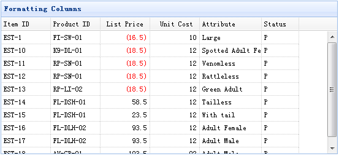

# jQuery EasyUI 数据网格 - 格式化列

以下实例格式化在 easyui DataGrid 里的列数据，并使用自定义列的 formatter，如果价格小于 20 就将文本变为红色。



为了格式化一个数据网格（DataGrid）列，我们需要设置 formatter 属性，它是一个函数。这个格式化函数包含三个参数：

*   value：当前列对应字段值。
*   row：当前的行记录数据。
*   index：当前的行下标。

#### 创建数据网格（DataGrid）

```
	<table id="tt" title="Formatting Columns" class="easyui-datagrid" style="width:550px;height:250px"
			url="data/datagrid_data.json"
			singleSelect="true" iconCls="icon-save">
		<thead>
			<tr>
				<th field="itemid" width="80">Item ID</th>
				<th field="productid" width="80">Product ID</th>
				<th field="listprice" width="80" align="right" formatter="formatPrice">List Price</th>
				<th field="unitcost" width="80" align="right">Unit Cost</th>
				<th field="attr1" width="100">Attribute</th>
				<th field="status" width="60" align="center">Stauts</th>
			</tr>
		</thead>
	</table>

```

请注意，'listprice' 字段有一个 'formatter' 属性，用来指明格式化函数。

#### 写格式化函数

```
	function formatPrice(val,row){
		if (val < 20){
			return '<span style="color:red;">('+val+')</span>';
		} else {
			return val;
		}
	}

```

## 下载 jQuery EasyUI 实例

[jeasyui-datagrid-datagrid7.zip](/try/jeasyui/download/jeasyui-datagrid-datagrid7.zip)

 