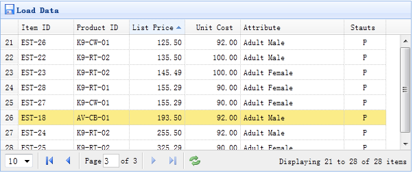

# jQuery EasyUI 数据网格 - 设置排序

本实例演示如何通过点击列表头来排序数据网格（DataGrid）。



数据网格（DataGrid）的所有列可以通过点击列表头来排序。您可以定义哪列可以排序。默认的，列是不能排序的，除非您设置 sortable 属性为 true。

#### 创建数据网格（DataGrid）

```
	<table id="tt" class="easyui-datagrid" style="width:600px;height:250px"
			url="datagrid8_getdata.php"
			title="Load Data" iconCls="icon-save"
			rownumbers="true" pagination="true">
		<thead>
			<tr>
				<th field="itemid" width="80" sortable="true">Item ID</th>
				<th field="productid" width="80" sortable="true">Product ID</th>
				<th field="listprice" width="80" align="right" sortable="true">List Price</th>
				<th field="unitcost" width="80" align="right" sortable="true">Unit Cost</th>
				<th field="attr1" width="150">Attribute</th>
				<th field="status" width="60" align="center">Stauts</th>
			</tr>
		</thead>
	</table>

```

我们定义一些可排序的列，包含 itemid、productid、listprice、unitcost 等等。'attr1' 列和 'status' 列不能排序。

当排序时，数据网格（DataGrid）将发送两个参数到远程服务器：

*   sort：排序列字段名。
*   order：排序方式，可以是 'asc' 或者 'desc'，默认值是 'asc'。

#### 服务器端代码

```
	$page = isset($_POST['page']) ? intval($_POST['page']) : 1;
	$rows = isset($_POST['rows']) ? intval($_POST['rows']) : 10;
	$sort = isset($_POST['sort']) ? strval($_POST['sort']) : 'itemid';
	$order = isset($_POST['order']) ? strval($_POST['order']) : 'asc';
	$offset = ($page-1)*$rows;

	$result = array();

	include 'conn.php';

	$rs = mysql_query("select count(*) from item");
	$row = mysql_fetch_row($rs);
	$result["total"] = $row[0];

	$rs = mysql_query("select * from item order by $sort $order limit $offset,$rows");

	$items = array();
	while($row = mysql_fetch_object($rs)){
		array_push($items, $row);
	}
	$result["rows"] = $items;

	echo json_encode($result);

```

## 下载 jQuery EasyUI 实例

[jeasyui-datagrid-datagrid8.zip](/try/jeasyui/download/jeasyui-datagrid-datagrid8.zip)

 