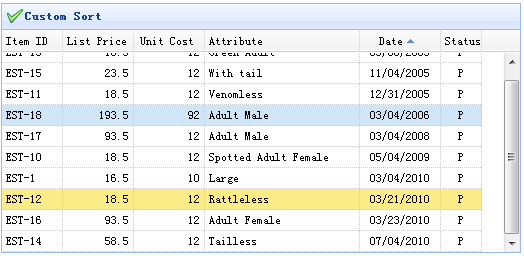

# jQuery EasyUI 数据网格 - 自定义排序

如果默认的排序行为不满足您的需求，您可以自定义数据网格（datagrid）的排序行为。



最基础的，用户可以在列上定义一个排序函数，函数名是 sorter。这个函数将接受两个值，返回值将如下：

valueA &gt; valueB =&gt; 返回 1

valueA &lt; valueB =&gt; 返回 -1

#### 自定义排序代码

```
	<table id="tt"></table>

```

```
	$('#tt').datagrid({
		title:'Custom Sort',
		iconCls:'icon-ok',
		width:520,
		height:250,
		singleSelect:true,
		remoteSort:false,
		columns:[[
			{field:'itemid',title:'Item ID',width:60,sortable:true},
			{field:'listprice',title:'List Price',width:70,align:'right',sortable:true},
			{field:'unitcost',title:'Unit Cost',width:70,align:'right',sortable:true},
			{field:'attr1',title:'Attribute',width:120,sortable:true},
			{field:'date',title:'Date',width:80,sortable:true,align:'center',
				sorter:function(a,b){
					a = a.split('/');
					b = b.split('/');
					if (a[2] == b[2]){
						if (a[0] == b[0]){
							return (a[1]>b[1]?1:-1);
						} else {
							return (a[0]>b[0]?1:-1);
						}
					} else {
						return (a[2]>b[2]?1:-1);
					}
				}
			},
			{field:'status',title:'Status',width:40,align:'center'}
		]]
	}).datagrid('loadData', data);

```

您可以从这段代码中看到，我们为 date 列创建了自定义的 sorter。日期的格式是 'dd/mm/yyyy'，可以轻松的按年月日排序。

## 下载 jQuery EasyUI 实例

[jeasyui-datagrid-datagrid14.zip](/try/jeasyui/download/jeasyui-datagrid-datagrid14.zip)

 