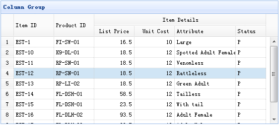

# jQuery EasyUI 数据网格 - 创建列组合

easyui 的数据网格（DataGrid）可以创建列组合，如下所示：



在本实例中，我们使用平面数据来填充数据网格（DataGrid）的数据，并把 listprice、unitcost、addr1、status 列组合在一个单一的列下。

为了创建列组合，您应该定义数据网格（datagrid）插件的 columns 数据。列的每个元素是定义一组可使用 rowspan 或 colspan 属性来进行组合的单元格。

下面的代码实现了上面的实例：

```
	<table id="tt" title="Column Group" class="easyui-datagrid" style="width:550px;height:250px"
			url="data/datagrid_data.json"
			singleSelect="true" iconCls="icon-save" rownumbers="true">
		<thead>
			<tr>
				<th rowspan="2" field="itemid" width="80">Item ID</th>
				<th rowspan="2" field="productid" width="80">Product ID</th>
				<th colspan="4">Item Details</th>
			</tr>
			<tr>
				<th field="listprice" width="80" align="right">List Price</th>
				<th field="unitcost" width="80" align="right">Unit Cost</th>
				<th field="attr1" width="100">Attribute</th>
				<th field="status" width="60" align="center">Stauts</th>
			</tr>
		</thead>
	</table>

```

## 下载 jQuery EasyUI 实例

[jeasyui-datagrid-datagrid9.zip](/try/jeasyui/download/jeasyui-datagrid-datagrid9.zip)

 