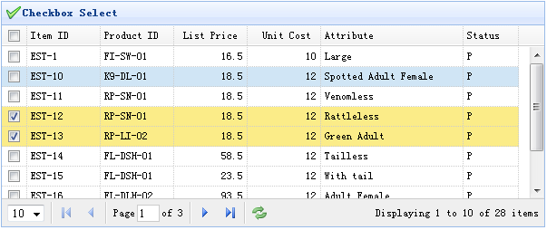

# jQuery EasyUI 数据网格 - 添加复选框

本实例演示如何放置一个复选框列到数据网格（DataGrid）。通过复选框，用户将可以选择 选中/取消选中 网格行数据。



为了添加一个复选框列，我们仅仅需要添加一个列的 checkbox 属性，并设置它为 true。代码如下所示：

```
	<table id="tt" title="Checkbox Select" class="easyui-datagrid" style="width:550px;height:250px"
			url="data/datagrid_data.json"
			idField="itemid" pagination="true"
			iconCls="icon-save">
		<thead>
			<tr>
				<th field="ck" checkbox="true"></th>
				<th field="itemid" width="80">Item ID</th>
				<th field="productid" width="80">Product ID</th>
				<th field="listprice" width="80" align="right">List Price</th>
				<th field="unitcost" width="80" align="right">Unit Cost</th>
				<th field="attr1" width="100">Attribute</th>
				<th field="status" width="60" align="center">Status</th>
			</tr>
		</thead>
	</table>

```

以上代码添加了一个带有 checkbox 属性的列，所以它将成为复选框列。如果 idField 属性已设置，数据网格（DataGrid）的选择集合将在不同的页面保持。

## 下载 jQuery EasyUI 实例

[jeasyui-datagrid-datagrid10.zip](/try/jeasyui/download/jeasyui-datagrid-datagrid10.zip)

 