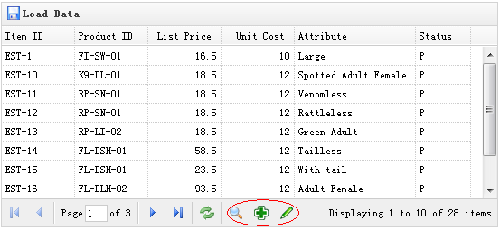

# jQuery EasyUI 数据网格 - 自定义分页

数据网格（datagrid）内置一个很好特性的分页功能，自定义也相当简单。在本教程中，我们将创建一个数据网格（datagrid），并在分页工具栏上添加一些自定义按钮。



#### 创建数据网格（DataGrid）

```
	<table id="tt" title="Load Data" class="easyui-datagrid" style="width:550px;height:250px"
			url="data/datagrid_data.json"
			iconCls="icon-save" pagination="true">
		<thead>
			<tr>
				<th field="itemid" width="80">Item ID</th>
				<th field="productid" width="80">Product ID</th>
				<th field="listprice" width="80" align="right">List Price</th>
				<th field="unitcost" width="80" align="right">Unit Cost</th>
				<th field="attr1" width="100">Attribute</th>
				<th field="status" width="60" align="center">Stauts</th>
			</tr>
		</thead>
	</table>

```

请记得，设置 'pagination' 属性为 true，这样才会生成分页工具栏。

#### 自定义分页工具栏

```
	var pager = $('#tt').datagrid('getPager');    // get the pager of datagrid
	pager.pagination({
		showPageList:false,
		buttons:[{
			iconCls:'icon-search',
			handler:function(){
				alert('search');
			}
		},{
			iconCls:'icon-add',
			handler:function(){
				alert('add');
			}
		},{
			iconCls:'icon-edit',
			handler:function(){
				alert('edit');
			}
		}],
		onBeforeRefresh:function(){
			alert('before refresh');
			return true;
		}
	});

```

正如您所看到的，我们首先得到数据网格（datagrid）的 pager 对象，然后重新创建分页（pagination）。我们隐藏页面列表，并添加三个新的按钮。

## 下载 jQuery EasyUI 实例

[jeasyui-datagrid-datagrid11.zip](/try/jeasyui/download/jeasyui-datagrid-datagrid11.zip)

 