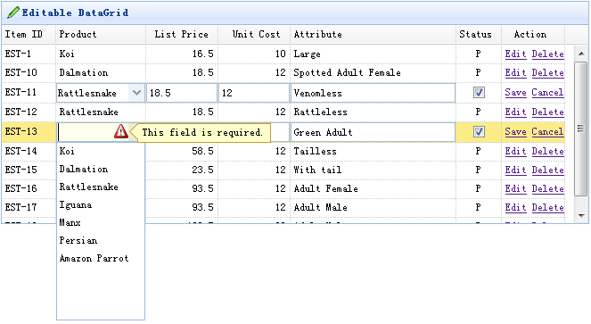

# jQuery EasyUI 数据网格 - 启用行内编辑

可编辑的功能是最近添加到数据网格（datagrid）的。它可以使用户添加一个新行到数据网格（datagrid）。用户也可以更新一个或多个行。

本教程向您展示如何创建一个数据网格（datagrid）和内联编辑器。



#### 创建数据网格（DataGrid）

```
	$(function(){
		$('#tt').datagrid({
			title:'Editable DataGrid',
			iconCls:'icon-edit',
			width:660,
			height:250,
			singleSelect:true,
			idField:'itemid',
			url:'datagrid_data.json',
			columns:[[
				{field:'itemid',title:'Item ID',width:60},
				{field:'productid',title:'Product',width:100,
					formatter:function(value){
						for(var i=0; i<products.length; i++){
							if (products[i].productid == value) return products[i].name;
						}
						return value;
					},
					editor:{
						type:'combobox',
						options:{
							valueField:'productid',
							textField:'name',
							data:products,
							required:true
						}
					}
				},
				{field:'listprice',title:'List Price',width:80,align:'right',editor:{type:'numberbox',options:{precision:1}}},
				{field:'unitcost',title:'Unit Cost',width:80,align:'right',editor:'numberbox'},
				{field:'attr1',title:'Attribute',width:150,editor:'text'},
				{field:'status',title:'Status',width:50,align:'center',
					editor:{
						type:'checkbox',
						options:{
							on: 'P',
							off: ''
						}
					}
				},
				{field:'action',title:'Action',width:70,align:'center',
					formatter:function(value,row,index){
						if (row.editing){
							var s = '<a href="#" onclick="saverow(this)">Save</a> ';
							var c = '<a href="#" onclick="cancelrow(this)">Cancel</a>';
							return s+c;
						} else {
							var e = '<a href="#" onclick="editrow(this)">Edit</a> ';
							var d = '<a href="#" onclick="deleterow(this)">Delete</a>';
							return e+d;
						}
					}
				}
			]],
			onBeforeEdit:function(index,row){
				row.editing = true;
				updateActions(index);
			},
			onAfterEdit:function(index,row){
				row.editing = false;
				updateActions(index);
			},
			onCancelEdit:function(index,row){
				row.editing = false;
				updateActions(index);
			}
		});
	});
	function updateActions(index){
		$('#tt').datagrid('updateRow',{
			index: index,
			row:{}
		});
	}

```

为了启用数据网格行内编辑，您应该添加一个 editor 属性到列中。编辑器（editor）会告诉数据网格（datagrid）如何编辑字段及如何保存字段值。正如您所看到的，我们定义的三个编辑器（editor）：text、combobox 和 checkbox。

```
	function getRowIndex(target){
		var tr = $(target).closest('tr.datagrid-row');
		return parseInt(tr.attr('datagrid-row-index'));
	}
	function editrow(target){
		$('#tt').datagrid('beginEdit', getRowIndex(target));
	}
	function deleterow(target){
		$.messager.confirm('Confirm','Are you sure?',function(r){
			if (r){
				$('#tt').datagrid('deleteRow', getRowIndex(target));
			}
		});
	}
	function saverow(target){
		$('#tt').datagrid('endEdit', getRowIndex(target));
	}
	function cancelrow(target){
		$('#tt').datagrid('cancelEdit', getRowIndex(target));
	}

```

## 下载 jQuery EasyUI 实例

[jeasyui-datagrid-datagrid12.zip](/try/jeasyui/download/jeasyui-datagrid-datagrid12.zip)

 