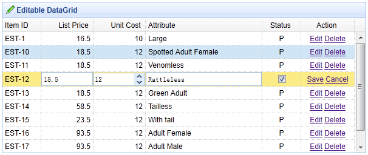

# jQuery EasyUI 数据网格 - 扩展编辑器

一些常见的编辑器（editor）添加到数据网格（datagrid），以便用户编辑数据。 所有的编辑器（editor）都定义在 $.fn.datagrid.defaults.editors 对象中，这个可以继承扩展以便支持新的编辑器（editor）。 本教程将向您展示如何添加一个新的 numberspinner 编辑器到数据网格（datagrid）。



#### 继承扩展 numberspinner 编辑器

```
	$.extend($.fn.datagrid.defaults.editors, {
		numberspinner: {
			init: function(container, options){
				var input = $('<input type="text">').appendTo(container);
				return input.numberspinner(options);
			},
			destroy: function(target){
				$(target).numberspinner('destroy');
			},
			getValue: function(target){
				return $(target).numberspinner('getValue');
			},
			setValue: function(target, value){
				$(target).numberspinner('setValue',value);
			},
			resize: function(target, width){
				$(target).numberspinner('resize',width);
			}
		}
	});

```

#### 在 html 标记中创建数据网格（DataGrid）

```
	<table id="tt" style="width:600px;height:250px"
			url="data/datagrid_data.json" title="Editable DataGrid" iconCls="icon-edit"
			singleSelect="true" idField="itemid" fitColumns="true">
		<thead>
			<tr>
				<th field="itemid" width="60">Item ID</th>
				<th field="listprice" width="80" align="right" editor="{type:'numberbox',options:{precision:1}}">List Price</th>
				<th field="unitcost" width="80" align="right" editor="numberspinner">Unit Cost</th>
				<th field="attr1" width="180" editor="text">Attribute</th>
				<th field="status" width="60" align="center" editor="{type:'checkbox',options:{on:'P',off:''}}">Status</th>
				<th field="action" width="80" align="center" formatter="formatAction">Action</th>
			</tr>
		</thead>
	</table>

```

我们分配 numberspinner 编辑器到 'unit cost' 字段。 当开始编辑一行，用户可以通过 numberspinner 编辑器来编辑数据。

## 下载 jQuery EasyUI 实例

[jeasyui-datagrid-datagrid23.zip](/try/jeasyui/download/jeasyui-datagrid-datagrid23.zip)

 