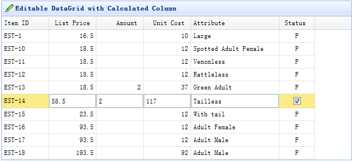

# jQuery EasyUI 数据网格 - 列运算

在本教程中，您将学习如何在可编辑的数据网格（datagrid）中包含一个运算的列。一个运算列通常包含一些从一个或多个其他列运算的值。



首先，创建一个可编辑的数据网格（datagrid）。这里我们创建了一些可编辑列，'listprice'、'amount' 和 'unitcost' 列定义为 numberbox 编辑类型。运算列是 'unitcost' 字段，将是 listprice 乘以 amount 列的结果。

```
	<table id="tt" style="width:600px;height:auto"
			title="Editable DataGrid with Calculated Column" iconCls="icon-edit" singleSelect="true"
			idField="itemid" url="data/datagrid_data.json">
		<thead>
			<tr>
				<th field="itemid" width="80">Item ID</th>
				<th field="listprice" width="80" align="right" editor="{type:'numberbox',options:{precision:1}}">List Price</th>
				<th field="amount" width="80" align="right" editor="{type:'numberbox',options:{precision:0}}">Amount</th>
				<th field="unitcost" width="80" align="right" editor="numberbox">Unit Cost</th>
				<th field="attr1" width="150" editor="text">Attribute</th>
				<th field="status" width="60" align="center" editor="{type:'checkbox',options:{on:'P',off:''}}">Status</th>
			</tr>
		</thead>
	</table>

```

当用户点击一行的时候，我们开始一个编辑动作。

```
	var lastIndex;
	$('#tt').datagrid({
		onClickRow:function(rowIndex){
			if (lastIndex != rowIndex){
				$('#tt').datagrid('endEdit', lastIndex);
				$('#tt').datagrid('beginEdit', rowIndex);
				setEditing(rowIndex);
			}
			lastIndex = rowIndex;
		}
	});

```

为了在一些列之间创建运算关系，我们应该得到当前的 editors，并绑定一些事件到它们上面。

```
	function setEditing(rowIndex){
		var editors = $('#tt').datagrid('getEditors', rowIndex);
		var priceEditor = editors[0];
		var amountEditor = editors[1];
		var costEditor = editors[2];
		priceEditor.target.bind('change', function(){
			calculate();
		});
		amountEditor.target.bind('change', function(){
			calculate();
		});
		function calculate(){
			var cost = priceEditor.target.val() * amountEditor.target.val();
			$(costEditor.target).numberbox('setValue',cost);
		}
	}

```

## 下载 jQuery EasyUI 实例

[jeasyui-datagrid-datagrid15.zip](/try/jeasyui/download/jeasyui-datagrid-datagrid15.zip)

 