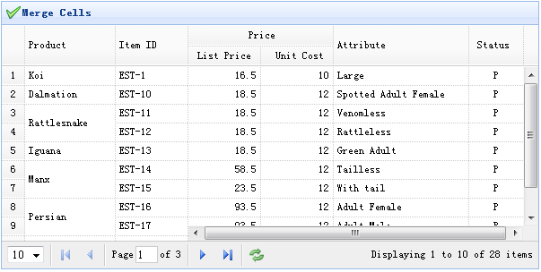

# jQuery EasyUI 数据网格 - 合并单元格

数据网格（datagrid）经常需要合并一些单元格。本教程将向您展示如何在数据网格（datagrid）中合并单元格。

为了合并数据网格（datagrid）单元格，只需简单地调用 'mergeCells' 方法，并传入合并信息参数，告诉数据网格（datagrid）如何合并单元格。在所有合并的单元格中，除了第一个单元格，其它单元格在合并后被隐藏。



#### 创建数据网格（DataGrid）

```
	<table id="tt" title="Merge Cells" style="width:550px;height:250px"
			url="data/datagrid_data.json"
			singleSelect="true" iconCls="icon-save" rownumbers="true"
			idField="itemid" pagination="true">
		<thead frozen="true">
			<tr>
				<th field="productid" width="80" formatter="formatProduct">Product ID</th>
				<th field="itemid" width="100">Item ID</th>
			</tr>
		</thead>
		<thead>
			<tr>
				<th colspan="2">Price</th>
				<th rowspan="2" field="attr1" width="150">Attribute</th>
				<th rowspan="2" field="status" width="60" align="center">Stauts</th>
			</tr>
			<tr>
				<th field="listprice" width="80" align="right">List Price</th>
				<th field="unitcost" width="80" align="right">Unit Cost</th>
			</tr>
		</thead>
	</table>

```

#### 合并单元格

当数据加载之后，我们合并数据网格（datagrid）中的一些单元格，所以放置下面的代码在 onLoadSuccess 回调函数中。

```
	$('#tt').datagrid({
		onLoadSuccess:function(){
			var merges = [{
				index:2,
				rowspan:2
			},{
				index:5,
				rowspan:2
			},{
				index:7,
				rowspan:2
			}];
			for(var i=0; i<merges.length; i++)
				$('#tt').datagrid('mergeCells',{
					index:merges[i].index,
					field:'productid',
					rowspan:merges[i].rowspan
				});
		}
	});

```

## 下载 jQuery EasyUI 实例

[jeasyui-datagrid-datagrid13.zip](/try/jeasyui/download/jeasyui-datagrid-datagrid13.zip)

 